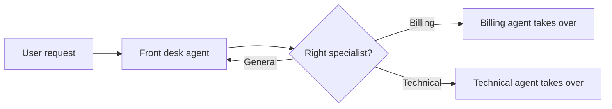

# Handoffs

<div class="topic-page" markdown="1">

<section class="topic-hero">
  <span class="topic-hero__eyebrow">Stage 10 - Multi-Agent Systems</span>
  <p class="topic-hero__lead">A handoff happens when one agent transfers control of a task or conversation to another agent. The first agent decides, "This is no longer my job," and the next agent takes over with the right instructions, context, and tools.</p>
  <div class="topic-hero__facts">
    <span>Transfer control</span>
    <span>Specialist takes over</span>
    <span>Sequential workflow</span>
    <span>Clear ownership</span>
    <span>Context matters</span>
  </div>
</section>

## Goal

Understand handoffs as a beginner-friendly multi-agent pattern.

After this lesson, you should be able to explain:

- what a handoff is,
- how it differs from calling a tool,
- when one agent should hand off to another,
- what information should be passed during a handoff,
- what can go wrong,
- how to design a simple handoff flow.

## Before You Start

Think about customer support.

```text
You call support.
Front desk listens to your problem.
They realize it is a billing issue.
They transfer you to the billing specialist.
The billing specialist continues the conversation.
```

That transfer is a handoff.

In an agent system:

```text
General support agent
  -> decides this is a billing problem
  -> hands off to billing agent
  -> billing agent owns the next turn
```

The important rule:

```text
After a handoff, the receiving agent becomes responsible for the task.
```

## Part 1: The Core Idea

A **handoff** is not just asking another agent a question.

It is a change in ownership.

Simple definition:

```text
A handoff transfers control from one agent to another agent because the next
agent is better suited to continue the task.
```

### Simple Picture



**How to read this diagram:** the first agent receives the request, decides which specialist should own it, and transfers control.

## Part 2: Handoffs vs Supervisor-Worker

Handoffs and supervisor-worker systems can look similar, but the ownership is different.

| Pattern | Who owns the user task? | What happens after another agent is involved? |
| --- | --- | --- |
| Supervisor-worker | Supervisor keeps ownership | Worker returns result to supervisor |
| Handoff | Receiving agent gets ownership | New agent continues the task |

In a supervisor-worker system:

```text
Supervisor asks researcher for facts.
Researcher returns facts.
Supervisor continues.
```

In a handoff:

```text
Support agent transfers to billing agent.
Billing agent continues with the user.
```

Beginner shortcut:

```text
Supervisor-worker means "help me with this subtask."
Handoff means "you take over from here."
```

## Part 3: What To Pass During A Handoff

A handoff should carry enough context for the next agent to continue without making the user repeat everything.

Useful handoff data:

- the user's original request,
- a short summary of the conversation so far,
- why the handoff is happening,
- the user's goal,
- important constraints,
- already completed actions,
- open questions,
- permissions or safety limits,
- links to relevant records or tool outputs.

Example handoff packet:

```json
{
  "from_agent": "front_desk",
  "to_agent": "billing",
  "reason": "User is asking about a refund status.",
  "user_goal": "Find out why refund has not arrived.",
  "summary": "User ordered item A102 and requested a refund 8 days ago.",
  "known_facts": {
    "order_id": "A102",
    "refund_requested": true
  },
  "open_questions": [
    "Has the refund been processed by the payment provider?"
  ]
}
```

Without this context, the receiving agent may ask duplicate questions or make wrong assumptions.

## Part 4: When To Use Handoffs

Handoffs work best when a task moves through clear stages or domains.

Good use cases:

- customer support routing,
- onboarding flows,
- sales to technical support,
- triage to specialist,
- legal review after draft generation,
- human approval after automated preparation,
- incident response stages.

Handoffs are especially useful when different agents need different tools.

Example:

| Agent | Tools |
| --- | --- |
| Front desk agent | account lookup, ticket creation |
| Billing agent | invoice lookup, refund status |
| Technical agent | logs, diagnostics, deployment status |

The front desk agent should not need every billing and technical tool. It only needs enough information to route the user.

### Common Beginner Mistakes

| Mistake | What Goes Wrong | Better Choice |
| --- | --- | --- |
| Handoff too early | User gets bounced around | Let the first agent collect basic facts |
| No handoff summary | New agent repeats questions | Pass a short structured summary |
| Unclear ownership | Both agents try to answer | Define who owns the next turn |
| Too many handoffs | Conversation feels broken | Limit handoffs and use clear routes |
| Missing return path | Specialist gets stuck | Allow escalation or clarification |

## End Example: Support To Billing Handoff

User says:

```text
I returned my headphones last week, but I still do not see the refund.
Can you check what happened?
```

Step-by-step handoff:

```text
1. Front desk agent receives the message.

2. It identifies the topic:
   "This is about refund status, so billing should handle it."

3. It collects or confirms basic information:
   - order ID
   - return date
   - user's account

4. It creates a handoff packet:
   - reason: refund status
   - known facts: order ID and return date
   - open question: whether refund was processed

5. Billing agent takes over:
   "I can help with the refund. I see the return was received on Monday.
   Let me check the payment processor status."
```

The key idea is simple:

```text
The first agent does not finish the task.
It transfers the task to the agent that should own it.
```

</div>
