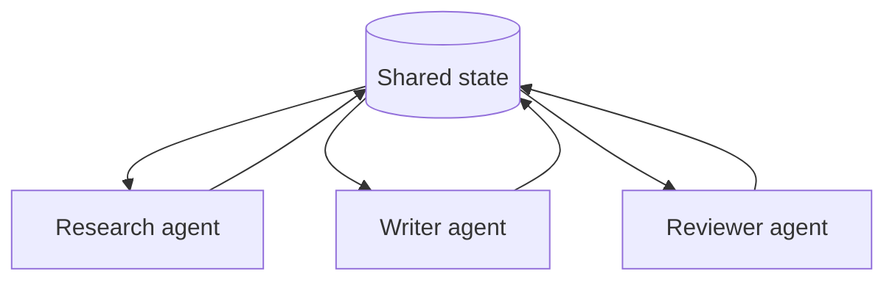
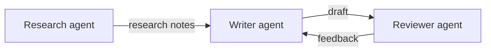
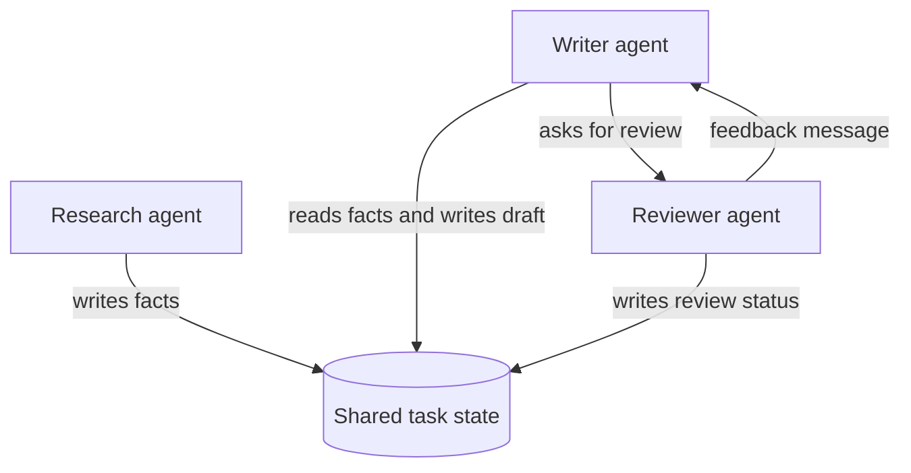

# Shared State vs Message Passing

<div class="topic-page" markdown="1">

<section class="topic-hero">
  <span class="topic-hero__eyebrow">Stage 10 - Multi-Agent Systems</span>
  <p class="topic-hero__lead">Shared state and message passing are two ways agents share information. Shared state is like a common whiteboard that every agent can read or update. Message passing is like sending notes directly from one agent to another.</p>
  <div class="topic-hero__facts">
    <span>Shared memory</span>
    <span>Direct messages</span>
    <span>Coordination</span>
    <span>Consistency</span>
    <span>Debugging</span>
  </div>
</section>

## Goal

Understand the two main ways agents communicate and share information.

After this lesson, you should be able to explain:

- what shared state means,
- what message passing means,
- how they are different,
- when shared state is useful,
- when message passing is useful,
- what can go wrong with each approach,
- how to choose a simple communication style.

## Before You Start

Start with two everyday analogies.

```text
Shared state:
  A team works in the same shared document.
  Everyone can see the latest version.

Message passing:
  Team members send notes or emails to each other.
  You only know what someone sends you.
```

Both approaches can work.

The key question is:

```text
Should agents look at one shared place for information,
or should they send information directly to each other?
```

## Part 1: Shared State

**Shared state** means agents read and write to one common place.

That common place might be:

- a database row,
- a task object,
- a shared memory store,
- a document,
- a graph state,
- a blackboard,
- a workflow context.

Simple definition:

```text
Shared state is a central memory or data object that multiple agents can read
from and write to during a workflow.
```

### Simple Picture



**How to read this diagram:** all agents use the same shared place to read current information and write their updates.

### Why Shared State Helps

Shared state is useful when many agents need a common view of the task.

Examples:

- a research plan,
- a list of completed steps,
- a draft document,
- a set of discovered facts,
- a task status,
- a shared memory of user preferences.

| Benefit | Why It Helps |
| --- | --- |
| Common view | Agents can see current task progress |
| Easier recovery | The workflow can resume from stored state |
| Better tracing | You can inspect what changed over time |
| Good for graphs | Each node can update the same state object |

### Risks Of Shared State

Shared state can become messy if every agent can write anything.

Common risks:

- one agent overwrites another agent's work,
- the state becomes too large,
- agents rely on stale fields,
- sensitive data is visible to agents that do not need it,
- it becomes unclear who changed what,
- debugging becomes hard when updates are not logged.

Good shared state design needs rules:

```text
Each agent should know:
  - which fields it may read,
  - which fields it may write,
  - what format its updates must use,
  - how conflicts are handled.
```

## Part 2: Message Passing

**Message passing** means agents communicate by sending explicit messages to each other.

There is no required shared memory. Each agent only knows:

- its own instructions,
- its own local context,
- messages it has received,
- results from tools it used.

Simple definition:

```text
Message passing is communication where agents send information directly to one
another instead of reading and writing one central state.
```

### Simple Picture



**How to read this diagram:** information moves only when one agent sends a message to another agent.

### Why Message Passing Helps

Message passing is useful when the workflow is sequential or conversation-like.

Examples:

- one agent asks another for help,
- a draft moves from writer to reviewer,
- a support agent hands off to billing,
- agents debate options,
- each agent should only see limited context.

| Benefit | Why It Helps |
| --- | --- |
| Clear communication | Every information transfer is explicit |
| Better isolation | Agents do not automatically see everything |
| Natural for chat | Conversation history is the main record |
| Easier permissions | Send only what the next agent needs |

### Risks Of Message Passing

Message passing can lose information if messages are incomplete.

Common risks:

- an agent forgets to pass an important detail,
- messages become long and repetitive,
- later agents do not know earlier context,
- two agents have different versions of the truth,
- it is hard to reconstruct the full task state,
- loops can happen if agents keep asking each other.

Good message passing needs clear message contracts:

```text
Every message should say:
  - what task it is about,
  - what information is known,
  - what the receiver should do,
  - what output format is expected,
  - what uncertainty remains.
```

## Part 3: How To Choose

Most real systems use a mix, but beginners should understand the difference first.

| Question | Prefer Shared State | Prefer Message Passing |
| --- | --- | --- |
| Do many agents need the same current data? | Yes | No |
| Is the workflow graph-like? | Yes | Sometimes |
| Is the task mostly a conversation? | Sometimes | Yes |
| Do agents need strict isolation? | Sometimes | Yes |
| Do you need resumable state? | Yes | Maybe |
| Is the workflow a clear chain? | Maybe | Yes |

Beginner rule:

```text
Use shared state when agents need a common workspace.
Use message passing when agents should communicate through explicit handoffs or requests.
```

## Part 4: A Simple Hybrid

Many practical systems combine both patterns.

Example:

```text
Shared state stores:
  - user goal
  - task status
  - final draft
  - approved facts

Messages carry:
  - requests from one agent to another
  - summaries
  - feedback
  - handoff reasons
```

Hybrid picture:



This gives you a central record while still keeping agent communication explicit.

### Common Beginner Mistakes

| Mistake | What Goes Wrong | Better Choice |
| --- | --- | --- |
| Everything in shared state | State becomes huge and confusing | Store durable facts, not every thought |
| No update rules | Agents overwrite each other | Define allowed fields per agent |
| Messages too short | Receiver lacks context | Include task, facts, request, output format |
| Messages too long | Cost and confusion rise | Send summaries and references |
| No trace | You cannot debug failures | Log state updates and messages |

## End Example: Research, Write, Review

Goal:

```text
Create a one-page summary of a new product idea.
```

### Version A: Shared State

```text
Shared state:
  goal: "Create a one-page summary of a new product idea"
  facts: []
  draft: ""
  review_notes: []

Research agent:
  writes facts into shared_state.facts

Writer agent:
  reads shared_state.facts
  writes shared_state.draft

Reviewer agent:
  reads shared_state.draft
  writes shared_state.review_notes

Writer agent:
  reads review notes and updates shared_state.draft
```

This feels like a team working on one shared document.

### Version B: Message Passing

```text
Research agent -> Writer agent:
  "Here are the important facts..."

Writer agent -> Reviewer agent:
  "Here is the draft. Please check clarity and missing risks."

Reviewer agent -> Writer agent:
  "The draft is clear, but it needs a risk section."

Writer agent -> User:
  final summary
```

This feels like a chain of emails.

The key idea is simple:

```text
Shared state means agents coordinate through a common workspace.
Message passing means agents coordinate by sending information to each other.
```

</div>
