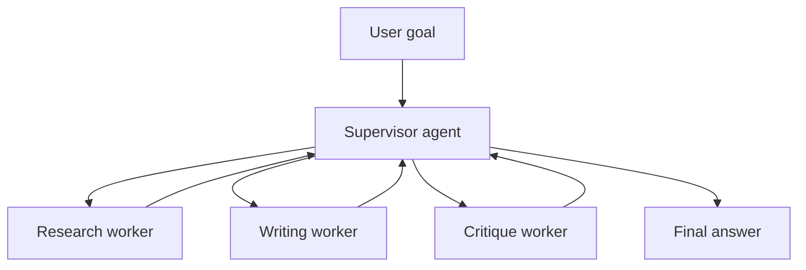

# Supervisor-Worker Pattern

<div class="topic-page" markdown="1">

<section class="topic-hero">
  <span class="topic-hero__eyebrow">Stage 10 - Multi-Agent Systems</span>
  <p class="topic-hero__lead">The supervisor-worker pattern is a multi-agent design where one main agent manages a team of specialist agents. The supervisor understands the user's goal, breaks it into smaller tasks, sends those tasks to workers, checks their outputs, and gives the final answer back to the user.</p>
  <div class="topic-hero__facts">
    <span>One manager</span>
    <span>Specialist workers</span>
    <span>Task delegation</span>
    <span>Quality control</span>
    <span>Final synthesis</span>
  </div>
</section>

## Goal

Understand the supervisor-worker pattern in simple terms and know when it is useful.

After this lesson, you should be able to explain:

- what the supervisor does,
- what worker agents do,
- how the supervisor breaks down a task,
- how worker results return to the supervisor,
- when this pattern helps,
- when it is too much complexity,
- how to design a tiny supervisor-worker system.

## Before You Start

Think of a multi-agent system like a workplace.

One person cannot do every job well, so a team divides the work:

```text
Manager:
  Understands the big goal.

Workers:
  Handle smaller specialized tasks.

Manager:
  Combines the work and reports the final result.
```

The supervisor-worker pattern copies that idea for AI agents.

```text
User request
  -> Supervisor agent
  -> Worker agent 1
  -> Worker agent 2
  -> Worker agent 3
  -> Supervisor agent
  -> Final answer
```

The important rule:

```text
The supervisor owns the task.
The workers only handle assigned subtasks.
```

## Part 1: The Core Idea

A **supervisor** is the main agent in charge.

It usually does five jobs:

1. Reads the user's request.
2. Decides what smaller tasks are needed.
3. Chooses the right worker for each task.
4. Reviews worker outputs.
5. Produces the final answer.

A **worker** is a specialist agent.

It usually does one type of work well:

- research,
- writing,
- coding,
- data analysis,
- reviewing,
- summarizing,
- planning,
- tool execution.

Simple definition:

```text
The supervisor-worker pattern uses one manager agent to coordinate multiple
specialist worker agents and combine their results into one answer.
```

### Simple Picture



**How to read this diagram:** the user talks to the supervisor. The supervisor talks to the workers. The workers report back to the supervisor. The supervisor gives the final answer.

## Part 2: Why Use This Pattern

Use a supervisor-worker system when a task is too large or mixed for one agent prompt to handle cleanly.

For example:

```text
User:
  "Research three competitors, compare their pricing, write a summary,
  and check the summary for missing risks."
```

A single agent can try to do all of this, but the prompt can become crowded.

A supervisor-worker setup can split it:

| Role | Job |
| --- | --- |
| Supervisor | Plans the work and combines the final answer |
| Research worker | Finds competitor facts |
| Pricing worker | Compares prices |
| Writer worker | Drafts the summary |
| Reviewer worker | Checks for missing risks |

This helps because each worker can have a focused prompt.

| Benefit | Why It Helps |
| --- | --- |
| Clear roles | Each worker has one job |
| Easier debugging | You can inspect each worker's output |
| Better quality control | The supervisor can reject weak work |
| Parallel work | Independent workers can run at the same time |
| Cleaner prompts | Each agent sees only what it needs |

## Part 3: What The Supervisor Should Control

The supervisor should not just forward the user's request to everyone.

It should make clear decisions:

- what task each worker receives,
- what context each worker needs,
- what output format each worker should return,
- whether workers can use tools,
- whether a worker result is good enough,
- whether a task needs another worker or retry.

A good supervisor instruction is specific:

```text
You are the supervisor.
Break the user's goal into subtasks.
Assign each subtask to exactly one worker.
Ask workers for concise, structured outputs.
Check whether each output answers the assigned subtask.
Use worker results to produce the final answer.
```

A worker instruction should also be specific:

```text
You are the research worker.
Your job is only to find relevant facts.
Do not write the final answer.
Return bullet points with source names when available.
```

The smaller and clearer the worker's job is, the easier it is to trust the result.

## Part 4: When Not To Use It

The supervisor-worker pattern adds coordination cost.

Do not use it just because it sounds advanced.

It may be overkill when:

- the task can be solved with one model call,
- the task has a fixed sequence of simple steps,
- worker outputs would mostly repeat each other,
- latency matters more than deep analysis,
- the supervisor has no real decisions to make,
- you cannot test whether the team is better than one agent.

Beginner rule:

```text
Use a supervisor-worker team only when specialization improves quality enough
to justify extra cost, latency, and debugging work.
```

### Common Beginner Mistakes

| Mistake | What Goes Wrong | Better Choice |
| --- | --- | --- |
| Too many workers | More agents create more noise | Start with two or three workers |
| Vague roles | Workers produce overlapping answers | Give each worker one clear job |
| No review step | Bad worker output reaches the user | Supervisor checks results |
| Workers see everything | Prompts become large and confusing | Send only needed context |
| No fallback | One bad worker blocks the task | Add retry or human review |

## End Example: Building A Blog Post Team

Imagine the user asks:

```text
Write a beginner-friendly blog post about password managers.
Include benefits, risks, and a short checklist.
```

A supervisor-worker design could look like this:

```text
Supervisor:
  "I need facts, structure, writing, and review."

Research worker:
  Finds simple facts about password managers.
  Returns:
    - They store passwords in an encrypted vault.
    - They help users create unique passwords.
    - The master password must be protected.

Outline worker:
  Creates the structure:
    1. What a password manager is
    2. Why unique passwords matter
    3. Risks and safe habits
    4. Beginner checklist

Writer worker:
  Writes the draft using the research and outline.

Reviewer worker:
  Checks if the draft is clear, safe, and beginner-friendly.

Supervisor:
  Combines everything, fixes weak parts, and returns the final blog post.
```

The key idea is simple:

```text
The user does not manage the team.
The supervisor manages the team for the user.
```

</div>
