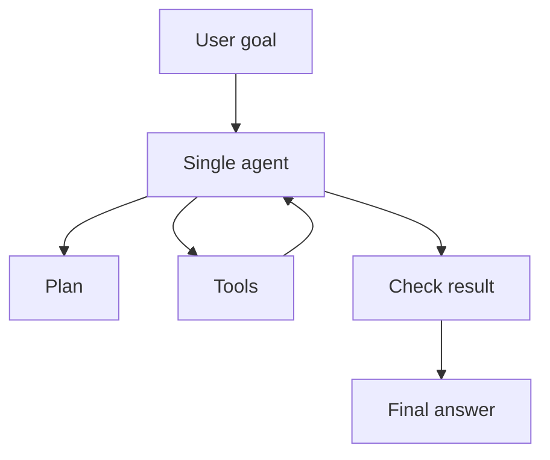
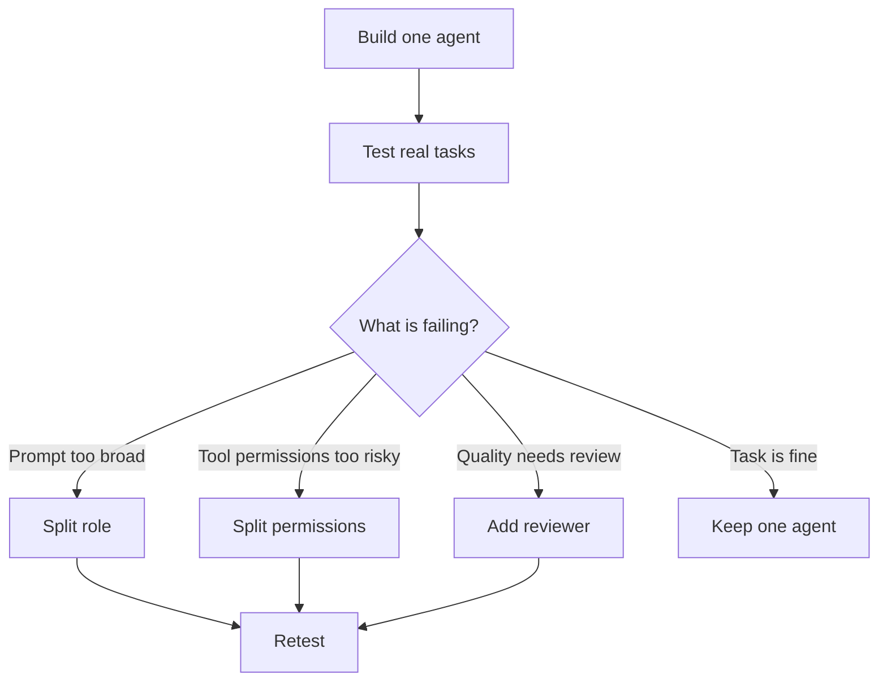

# How To Tell When One Agent Is Enough

<div class="topic-page" markdown="1">

<section class="topic-hero">
  <span class="topic-hero__eyebrow">Stage 10 - Multi-Agent Systems</span>
  <p class="topic-hero__lead">One agent is enough when the task has one clear owner, one main context, a manageable number of tools, and no strong need for separate specialist roles. Multi-agent systems are useful, but they should solve real coordination needs, not create extra ones.</p>
  <div class="topic-hero__facts">
    <span>Keep it simple</span>
    <span>One owner</span>
    <span>Clear context</span>
    <span>Lower cost</span>
    <span>Easier debugging</span>
  </div>
</section>

## Goal

Learn how to decide whether a task needs multiple agents or whether one well-designed agent is enough.

After this lesson, you should be able to explain:

- why one agent is often the better starting point,
- what signs show that one agent is enough,
- what signs suggest multiple agents may help,
- how to compare a single-agent design with a multi-agent design,
- how to avoid adding agents only because the architecture sounds advanced,
- how to upgrade from one agent to many agents gradually.

## Before You Start

Multi-agent systems can be useful, but they are not automatically better.

Start with the simplest working design:

```text
User goal
  -> one agent
  -> tools if needed
  -> final answer or action
```

Add more agents only when the task becomes easier to control, evaluate, secure, or scale with clear role separation.

Beginner rule:

```text
Use one agent until you can clearly explain what breaks without another agent.
```

## Part 1: The Core Idea

One agent is enough when one agent can own the task from start to finish without becoming confusing, unsafe, too expensive, or too hard to evaluate.

Simple definition:

```text
One agent is enough when a single agent can understand the goal, access the
needed context and tools, perform the steps, check its work, and stop reliably.
```

This does not mean the agent must do everything from memory.

A single agent can still use:

- tools,
- MCP servers,
- retrieval,
- memory,
- code execution,
- databases,
- search,
- approval steps,
- structured state.

The question is not:

```text
Does the task have multiple steps?
```

The better question is:

```text
Do those steps need separate agent ownership?
```

### Simple Picture



**How to read this diagram:** one agent owns the goal, uses tools as needed, checks the result, and gives the final answer.

## Part 2: Signs One Agent Is Enough

Use one agent when the task has one clear workflow and does not require separated ownership.

| Sign | What It Means | Example |
| --- | --- | --- |
| One clear owner | One agent can be responsible for success | Summarize a report and answer questions |
| One main context | The agent can hold or retrieve what it needs | Read three files and compare them |
| Few tools | The tool set is manageable | Search docs, read files, run tests |
| Low permission complexity | The same agent can safely use the allowed tools | Read-only research task |
| Simple output | The final answer has one format | Write a bug summary |
| Easy evaluation | You can check quality without splitting roles | Unit tests pass or report includes required sections |
| Short or medium task | The work fits inside a controlled loop | Investigate one failing test |
| No specialist boundaries | The same instructions can cover the task | Draft and lightly edit a short email |

Beginner shortcut:

```text
If the only reason for adding another agent is "this task has several steps,"
one agent is probably enough.
```

### Example: One Agent Is Enough

Task:

```text
Read this product feedback CSV, identify the top three complaints, and write a short summary.
```

One agent can:

1. Read the file.
2. Group complaints.
3. Count common themes.
4. Check the results.
5. Write the summary.

This does not need a separate reader agent, statistics agent, writer agent, and reviewer agent unless the task becomes larger or more sensitive.

## Part 3: When Multiple Agents May Help

Multiple agents can help when separate roles make the system easier to control.

| Signal | Why Another Agent May Help | Example |
| --- | --- | --- |
| Strong role separation | Different agents need different instructions | Researcher, writer, reviewer |
| Different tool permissions | One agent should not have all tools | Support agent cannot issue refunds, billing agent can |
| Different ownership | Another agent should take over the task | Handoff from triage to specialist |
| Parallel independent work | Work can be safely split | Compare five vendors at the same time |
| Specialized evaluation | A critic or judge agent checks output | Safety review before publishing |
| Long-running work | A remote agent can own a task over time | Compliance review that may take hours |
| Different systems or vendors | Agents live in separate platforms | A2A connection to external agent |
| Debugging needs separation | You need to inspect each role output | Supervisor-worker report generation |

The key is that each extra agent should reduce complexity somewhere else.

```text
Add an agent when the new boundary makes the system clearer.
Do not add an agent when it only moves confusion into messages.
```

## Part 4: One Agent vs Many Agents

Compare designs before building.

| Design Question | One Agent | Multiple Agents |
| --- | --- | --- |
| Who owns the goal? | One agent | Supervisor, workflow, or receiving specialist |
| How many prompts must be maintained? | One main prompt | Several role prompts |
| How is context shared? | One working context | Handoffs, messages, or shared state |
| How are tools controlled? | One permission set | Per-agent permission sets |
| How is cost controlled? | Fewer model calls | More calls, sometimes parallel |
| How is debugging done? | Inspect one trace | Inspect each agent and coordination |
| What can fail? | Reasoning, tools, stop rules | All single-agent failures plus coordination failures |

For many beginner projects, the one-agent version is easier to build, test, and improve.

### Cost And Latency

Multiple agents often increase:

- model calls,
- tool calls,
- messages,
- retries,
- state updates,
- trace size,
- latency.

Sometimes that cost is worth it. For example, parallel research agents may finish faster than one sequential research agent.

But do not assume that more agents are faster.

```text
Parallel work helps only when the subtasks are truly independent and the
coordination overhead is smaller than the time saved.
```

### Debugging

One agent can be debugged by reading one trace:

```text
Goal -> plan -> tool call -> observation -> answer
```

A multi-agent system needs more trace detail:

```text
Goal -> supervisor plan -> worker assignment -> worker output ->
state update -> reviewer feedback -> revised assignment -> final answer
```

If your team cannot inspect those traces, start with one agent.

## Part 5: Decision Checklist

Use this checklist before adding another agent.

| Question | If Yes | If No |
| --- | --- | --- |
| Can one agent understand the full goal? | Keep one agent | Consider splitting roles |
| Can one agent access the needed context safely? | Keep one agent | Consider separate agents or tools |
| Can one agent use the needed tools with one permission set? | Keep one agent | Split by permissions |
| Is the output easy to evaluate directly? | Keep one agent | Add reviewer or evaluator if needed |
| Are subtasks strongly independent? | Maybe split for parallel work | Keep one agent |
| Does another agent reduce risk? | Consider multi-agent | Keep one agent |
| Does another agent reduce complexity? | Consider multi-agent | Keep one agent |
| Can you trace and debug coordination? | Multi-agent is possible | Avoid multi-agent for now |

### Simple Rule

```text
If a second agent does not make ownership, safety, quality, or scale clearer,
do not add it.
```

## Part 6: Start With One Agent, Then Split

A practical way to design agents is to start with one agent and split only when you find a real reason.



This avoids designing a team before you know what the task needs.

### Common Split Points

| Pain In One Agent | Possible Split |
| --- | --- |
| Prompt becomes too broad | Separate planner, researcher, writer, or reviewer |
| Agent needs risky write tools and safe read tools | Separate read-only agent from action agent |
| Output quality varies | Add reviewer or evaluator agent |
| Different user domains require different instructions | Add handoff to domain specialist |
| Work can run independently | Add workers under a supervisor |
| External system owns a specialist agent | Use A2A to call that remote agent |

Do not split only because the agent has a long prompt. First remove unnecessary instructions, improve tool schemas, and make state clearer.

## Part 7: Examples

### Example 1: Keep One Agent

User asks:

```text
Find the failing test, inspect the related file, patch the bug, and rerun the test.
```

One coding agent is enough when:

- it can read files,
- it can run tests,
- it can edit code,
- the bug is focused,
- the final check is clear.

Adding separate planner, debugger, patcher, and reviewer agents would probably slow the task down.

### Example 2: Add A Reviewer Agent

User asks:

```text
Draft a public security advisory for a production incident.
```

Multiple agents may help because:

- the writer drafts the advisory,
- the security reviewer checks technical accuracy,
- the legal or policy reviewer checks wording,
- publication may require approval.

The extra agents reduce risk because the output is sensitive.

### Example 3: Add A Handoff

User asks:

```text
I cannot log in, and I also need to update my billing address.
```

A support triage agent may collect basic context, then hand off:

- login issue to technical support,
- billing address update to billing support.

The split helps because the tools and permissions are different.

### Example 4: Avoid Fake Teams

Weak design:

```text
One planner agent, one thinker agent, one answer agent, and one confidence agent
for every simple question.
```

Better design:

```text
One agent answers simple questions directly.
It uses tools or asks for help only when the task requires it.
```

More agents do not automatically mean more intelligence.

## Part 8: Anti-Patterns

| Anti-Pattern | What It Looks Like | Better Choice |
| --- | --- | --- |
| Agent for every step | Every small action gets its own agent | Use one agent with tools |
| Role names without real boundaries | Planner, thinker, reasoner all do similar work | Merge roles |
| Reviewer without criteria | Reviewer says "looks good" | Give explicit checklist |
| Parallel agents on dependent work | Agents need each other's outputs but run at once | Use sequential steps |
| Shared everything | Every agent sees all data and tools | Limit context and permissions |
| No owner | Many agents contribute, nobody owns final answer | Assign final owner |
| Multi-agent before baseline | Team is built before one-agent version is tested | Build one-agent baseline first |

## Part 9: One-Agent Design Template

Use this template before deciding to split.

```text
Agent name:
Primary goal:

Inputs:
- User request:
- Files or documents:
- Retrieved context:
- Tool observations:

Allowed tools:
- Tool name:
- Read or write:
- Requires approval:

Working state:
- Goal:
- Current step:
- Evidence collected:
- Open questions:
- Done criteria:

Reflection checks:
- Does the answer satisfy the user goal?
- Is there enough evidence?
- Are any risky actions pending approval?
- Should the agent ask the user?

Stop rules:
- Success:
- Max iterations:
- Timeout:
- Unsafe request:
```

If this design is clear and works in tests, one agent is enough.

## End Example: Deciding The Architecture

Task:

```text
Create a weekly engineering status summary from GitHub issues, pull requests,
and deployment notes.
```

Start with one agent:

```text
1. Read GitHub issues.
2. Read pull requests.
3. Read deployment notes.
4. Group updates by project.
5. Write summary.
6. Check required sections.
```

One agent is enough if:

- data access is read-only,
- the summary format is stable,
- the task runs within time and cost limits,
- the output passes review,
- failures are easy to debug.

Split later only if you see real problems:

| Problem | Possible Split |
| --- | --- |
| GitHub and deployment systems need different permissions | Separate data collection agents |
| Summary quality is inconsistent | Add reviewer agent |
| Each project needs a domain expert | Add project specialist agents |
| Work is too slow and independent | Add parallel workers |
| Another team owns deployment notes | Use A2A to call their agent |

The best architecture is the smallest one that reliably solves the task.

## Practice

### Exercise 1: One Agent Or Many

Choose whether one agent is enough.

| Task | One Agent Enough? | Reason |
| --- | --- | --- |
| Summarize one uploaded PDF |  |  |
| Investigate one failing test in a repo |  |  |
| Draft a public legal policy update |  |  |
| Compare ten vendors using five independent research sources |  |  |
| Route a customer issue between billing and technical support |  |  |

### Exercise 2: Find The Real Split

A team proposes four agents:

```text
Planner Agent -> Research Agent -> Thinking Agent -> Answer Agent
```

Which agents would you keep, merge, or remove? Explain what boundary each remaining agent owns.

### Exercise 3: Build The Baseline

Write a one-agent design for this task:

```text
Read customer feedback from a spreadsheet and produce the top five product issues.
```

Include:

- tools,
- state,
- output format,
- stop rules,
- approval needs.

## Exit Criteria

You understand this topic when you can:

- explain why one agent is often the best starting point,
- name at least five signs that one agent is enough,
- name at least five signs that multiple agents may help,
- compare one-agent and multi-agent designs,
- identify fake role splits,
- write a one-agent baseline design,
- explain when to split by role, permissions, evaluation, or ownership.

</div>
