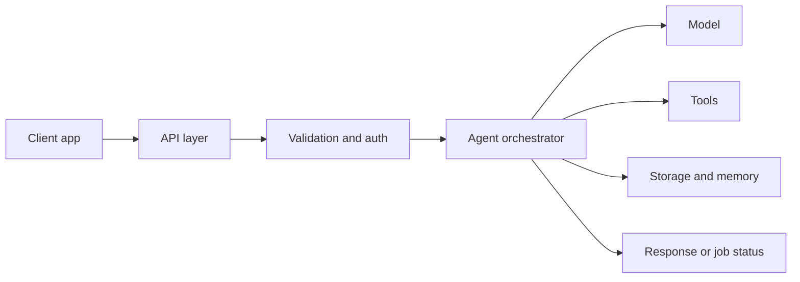
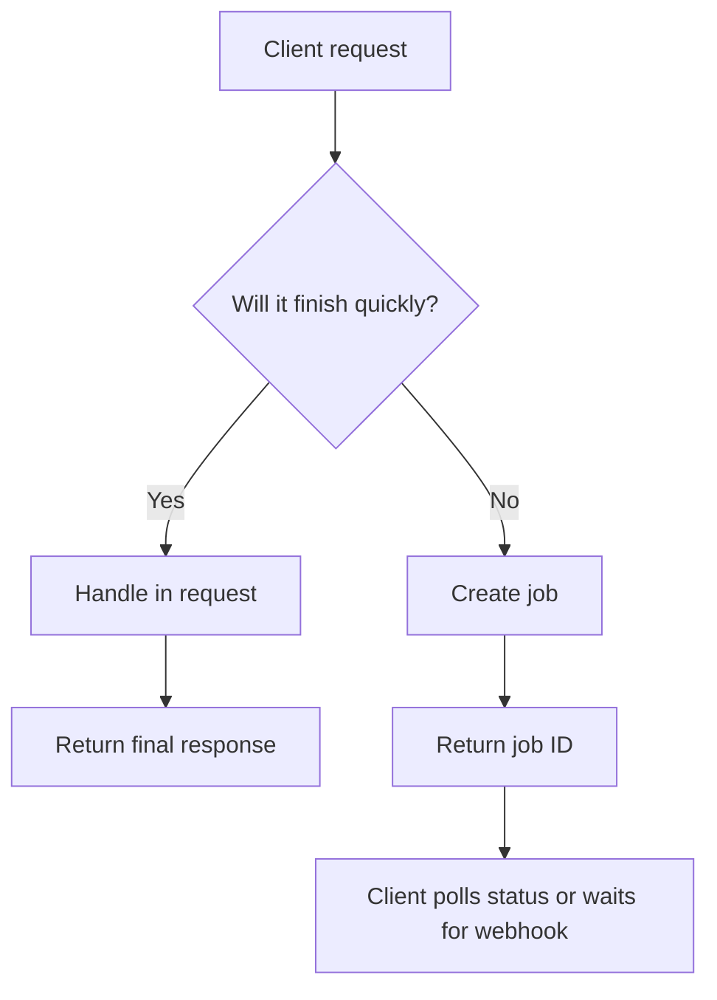
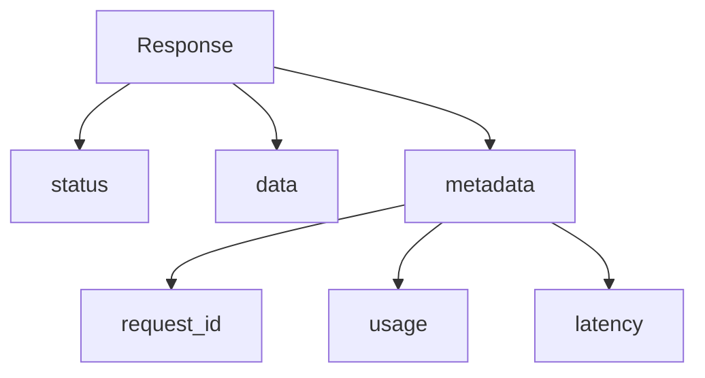
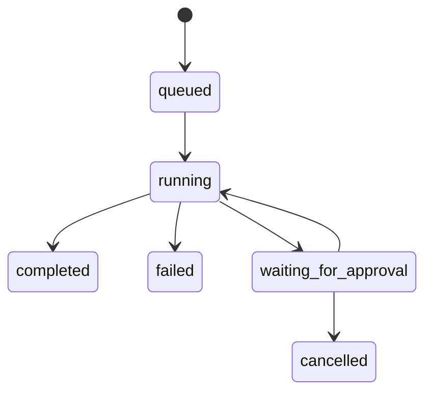
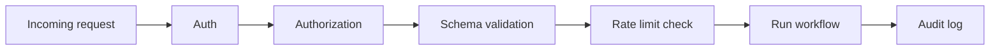

# API Design

<div class="topic-page" markdown="1">

<section class="topic-hero">
  <span class="topic-hero__eyebrow">Stage 13 - Production Deployment</span>
  <p class="topic-hero__lead">API design is how you turn an AI agent into a reliable product interface. A good API gives clients a clear way to send work, receive results, track long-running jobs, handle errors, and enforce safety rules without exposing internal complexity.</p>
  <div class="topic-hero__facts">
    <span>Endpoints</span>
    <span>Request shapes</span>
    <span>Async jobs</span>
    <span>Errors</span>
    <span>Safety</span>
  </div>
</section>

## Goal

Understand API design for AI agents in a simple, beginner-friendly way.

After this lesson, you should be able to explain:

- what an API does in an agent system,
- which endpoints a production agent often needs,
- when to use synchronous responses vs background jobs,
- how to shape requests and responses clearly,
- how to return errors and status updates,
- how auth, limits, and idempotency protect the system.

## Quick Summary

Use this short table first.

| API Part | Simple Meaning | Why It Matters |
| --- | --- | --- |
| Endpoint | a URL for one job | gives clients a stable entry point |
| Request schema | the input shape | prevents confusing input |
| Response schema | the output shape | makes integration predictable |
| Auth | who is allowed to call | protects the system |
| Rate limit | how much can be called | prevents overload |
| Async job API | start now, finish later | supports long-running agent work |
| Status API | check progress | helps clients track jobs |
| Error format | standard failure shape | makes recovery easier |

Beginner rule:

```text
A good AI API does not expose agent chaos.
It exposes a clean contract.
```

## Before You Start

Start with one simple idea:

```text
The model is not the API.
The API is the product surface around the model.
```

Example:

```text
Bad mental model:
  client -> prompt -> answer

Better production model:
  client -> API -> auth -> validation -> agent workflow -> result or job status
```

### Key Words In Plain English

| Word | Simple Meaning | Beginner Example |
| --- | --- | --- |
| Endpoint | one address in the API | `/chat`, `/jobs`, `/runs/{id}` |
| Payload | the input body | user question plus settings |
| Response | what the API returns | answer text or job ID |
| Schema | the allowed structure | required fields and types |
| Auth | identity check | API key or bearer token |
| Idempotency | same request should not duplicate work | safe retry of `POST /jobs` |
| Webhook | API calls you back later | job completion event |
| Polling | client checks status repeatedly | `GET /jobs/{id}` |

## Learning Path

This topic is designed in four parts. Read them in order.

<div class="learning-grid learning-grid--path">
  <a class="learning-card" href="#part-1-understand-what-the-api-is-for">
    <strong>Part 1 - Understand What The API Is For</strong>
    <span>Learn the role of the API in a production agent system.</span>
  </a>
  <a class="learning-card" href="#part-2-design-the-core-endpoints">
    <strong>Part 2 - Design The Core Endpoints</strong>
    <span>Choose simple endpoints for chat, tasks, runs, and status checks.</span>
  </a>
  <a class="learning-card" href="#part-3-shape-requests-responses-and-errors">
    <strong>Part 3 - Shape Requests, Responses, And Errors</strong>
    <span>Make inputs and outputs clear, stable, and easy to validate.</span>
  </a>
  <a class="learning-card" href="#part-4-add-production-rules">
    <strong>Part 4 - Add Production Rules</strong>
    <span>Protect the API with auth, limits, retries, and observability.</span>
  </a>
</div>

## Part 1: Understand What The API Is For

An AI agent may use prompts, tools, memory, and background workers internally. Clients should not need to know all that.

The API gives them a clean way to use the system.

Simple definition:

```text
API design is the contract between your agent system
and the outside world.
```

### The Big Picture



**How to read this diagram:** the API is the front door. It accepts requests, checks them, starts the agent workflow, and returns either a direct answer or a way to track progress.

### What A Good Agent API Should Do

| Need | API Job |
| --- | --- |
| Accept user input safely | validate schema and size |
| Start the right workflow | route to chat, retrieval, or task execution |
| Hide internal complexity | avoid leaking tool details unless needed |
| Support short and long tasks | synchronous and asynchronous patterns |
| Return predictable results | standard response shapes |
| Handle failures cleanly | consistent error objects |
| Protect resources | auth, rate limits, quotas |

### API Design vs Model Prompt Design

| API Design | Prompt Design |
| --- | --- |
| external contract | internal instruction |
| stable for clients | can evolve more often |
| defines fields, status, errors | defines behavior and output style |
| used by frontend or other services | used by orchestrator or model layer |

Beginner rule:

```text
Clients integrate with your API.
Your API integrates with your prompts.
```

## Part 2: Design The Core Endpoints

Start small. Most agent products do not need many endpoints at first.

### Simple API Shapes

| Pattern | Best For | Example |
| --- | --- | --- |
| `POST /chat` | quick synchronous answers | assistant reply in one request |
| `POST /jobs` | long-running tasks | research, report generation |
| `GET /jobs/{id}` | checking progress | poll job status |
| `POST /actions/{id}/approve` | risky actions | approve email send |
| `GET /health` | operations | health check for deployment |

### Synchronous vs Asynchronous API



### Example Endpoint Table

| Endpoint | Method | Purpose | Returns |
| --- | --- | --- | --- |
| `/chat` | `POST` | direct Q&A | answer text, citations, usage |
| `/jobs` | `POST` | start long task | job ID and initial status |
| `/jobs/{id}` | `GET` | check job | status, progress, result if done |
| `/runs/{id}/events` | `GET` | trace progress | step events |
| `/health` | `GET` | deployment check | healthy or unhealthy |

### Example: Simple Chat API

Request:

```json
{
  "message": "Summarize yesterday's support issues.",
  "user_id": "user_123",
  "conversation_id": "conv_456"
}
```

Response:

```json
{
  "answer": "Yesterday there were 12 support issues. The main themes were login failures, billing confusion, and one API outage.",
  "conversation_id": "conv_456",
  "usage": {
    "input_tokens": 1420,
    "output_tokens": 120
  }
}
```

### Example: Background Job API

Request:

```json
{
  "task": "Generate weekly incident report",
  "workspace_id": "team_42"
}
```

Immediate response:

```json
{
  "job_id": "job_789",
  "status": "queued"
}
```

Later status check:

```json
{
  "job_id": "job_789",
  "status": "completed",
  "result": {
    "report_url": "/artifacts/job_789/report.pdf"
  }
}
```

### Basic Endpoint Map

```mermaid
flowchart LR
    U[User or frontend] --> C1[POST /chat]
    U --> C2[POST /jobs]
    U --> C3[GET /jobs/{id}]
    C1 --> A[Agent workflow]
    C2 --> Q[Queue]
    Q --> W[Worker]
    W --> A
    A --> DB[Results store]
    C3 --> DB
```

## Part 3: Shape Requests, Responses, And Errors

Good API design is mostly about consistency.

### Request Design Rules

| Rule | Why It Helps |
| --- | --- |
| Use clear field names | easier for beginners and clients |
| Keep required fields minimal | reduces client mistakes |
| Validate types and lengths | stops bad input early |
| Separate user input from options | cleaner contracts |
| Use IDs for important objects | easier tracing and retries |

### Clean Request Shape

```json
{
  "input": {
    "message": "Draft a release note from these changes."
  },
  "context": {
    "workspace_id": "team_42",
    "user_id": "user_123"
  },
  "options": {
    "stream": false,
    "priority": "normal"
  }
}
```

### Response Design Rules

| Rule | Why It Helps |
| --- | --- |
| Return one predictable top-level shape | simpler parsing |
| Include IDs and status | easier debugging |
| Separate result from metadata | cleaner client logic |
| Include usage or timing if useful | helps monitor cost and latency |

### Response Pattern



### Example Standard Response

```json
{
  "status": "success",
  "data": {
    "answer": "The release note draft is ready."
  },
  "metadata": {
    "request_id": "req_abc123",
    "latency_ms": 1340
  }
}
```

### Error Design

Bad error:

```json
{
  "error": "failed"
}
```

Better error:

```json
{
  "status": "error",
  "error": {
    "code": "RATE_LIMITED",
    "message": "Too many requests. Try again in 30 seconds.",
    "retryable": true
  },
  "metadata": {
    "request_id": "req_abc123"
  }
}
```

### Common Error Types

| Error Code | Meaning | Client Action |
| --- | --- | --- |
| `INVALID_INPUT` | payload is wrong | fix request |
| `UNAUTHORIZED` | missing or bad auth | authenticate again |
| `FORBIDDEN` | caller lacks permission | stop or request access |
| `RATE_LIMITED` | too many requests | retry later |
| `JOB_NOT_FOUND` | wrong ID | check ID |
| `UPSTREAM_TIMEOUT` | model or tool timed out | retry if safe |
| `SAFETY_BLOCKED` | risky action denied | ask for approval or change request |

### Simple Status Lifecycle



## Part 4: Add Production Rules

Production API design is not only about endpoints. It is also about operational rules.

### The Four Core Protections

| Protection | Simple Meaning | Example |
| --- | --- | --- |
| Auth | verify identity | bearer token |
| Authorization | verify permission | only admins can trigger exports |
| Rate limiting | control traffic volume | 60 requests per minute |
| Idempotency | safe retries | same job request is not duplicated |

### Safety And Control Diagram



### Observability Fields Worth Returning Or Logging

| Field | Why It Matters |
| --- | --- |
| `request_id` | trace one request across services |
| `job_id` | track async runs |
| `user_id` | audit usage safely |
| `latency_ms` | monitor speed |
| `input_tokens` | cost analysis |
| `output_tokens` | cost analysis |
| `error_code` | failure grouping |

### Idempotency Example

Problem:

```text
Client sends POST /jobs
Network breaks before response arrives
Client retries
Without protection, two jobs may start
```

Solution:

```text
Client sends an idempotency key
Server stores the first result for that key
Retry returns the same job instead of creating a new one
```

### Beginner Architecture Recommendation

Start with this shape:

| Layer | Simple Recommendation |
| --- | --- |
| API | one backend service |
| Sync endpoint | `POST /chat` |
| Async endpoint | `POST /jobs` + `GET /jobs/{id}` |
| Storage | one SQL database |
| Queue | one simple background worker system |
| Safety | auth + validation + approval for risky actions |
| Monitoring | request logs + latency + error rate |

Do not start with too many endpoints.

```text
Simple and clear beats large and clever.
```

## Summary

Use this section to remember the main idea.

| Main Idea | Short Meaning |
| --- | --- |
| API is the product surface | clients use the API, not your prompt |
| Start with a few endpoints | chat, jobs, status, health |
| Use sync for fast work | immediate answers |
| Use async for slow work | queue and workers |
| Standardize responses and errors | easier client integration |
| Add auth, limits, and idempotency | production protection |

## Practice

1. Design a `POST /chat` request and response for a support assistant.
2. Decide when your agent should use `POST /jobs` instead of `POST /chat`.
3. Define three error codes your API should return.
4. Explain why `request_id` and `job_id` are useful.

## Mini Project

Design a small API for an internal research agent.

Include:

- one synchronous endpoint,
- one asynchronous endpoint,
- one status endpoint,
- one approval endpoint,
- one error response format.

Then answer:

1. Which requests should finish immediately?
2. Which requests should become background jobs?
3. What fields should you log for debugging and cost tracking?

## Exit Criteria

You are ready to move on when you can:

- explain the role of an API in a production agent system,
- design basic endpoints for quick and long-running tasks,
- define a clean request and response shape,
- return standard errors and job statuses,
- explain auth, rate limits, and idempotency in plain language.

## Resources

- [FastAPI - Request Body](https://fastapi.tiangolo.com/tutorial/body/)
- [FastAPI - Background Tasks](https://fastapi.tiangolo.com/tutorial/background-tasks/)
- [HTTP Semantics - RFC 9110](https://www.rfc-editor.org/rfc/rfc9110)
- [MDN - HTTP Response Status Codes](https://developer.mozilla.org/en-US/docs/Web/HTTP/Status)
- [OWASP - REST Security Cheat Sheet](https://cheatsheetseries.owasp.org/cheatsheets/REST_Security_Cheat_Sheet.html)

</div>
