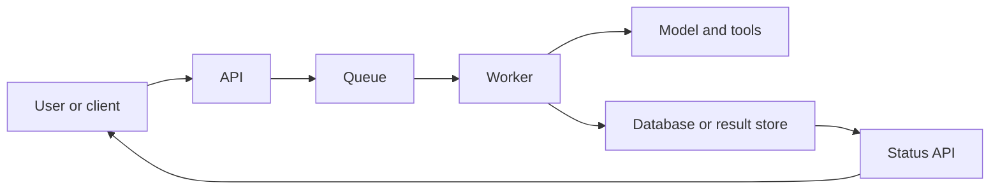
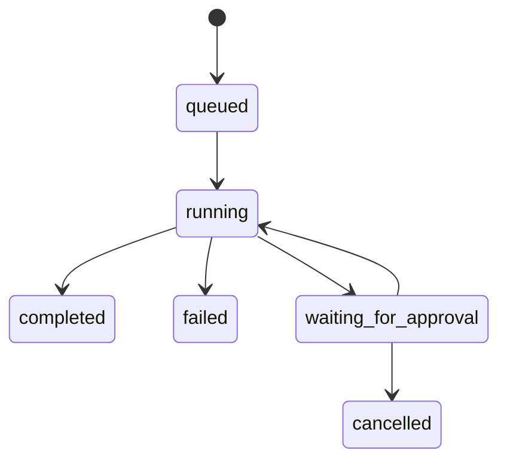
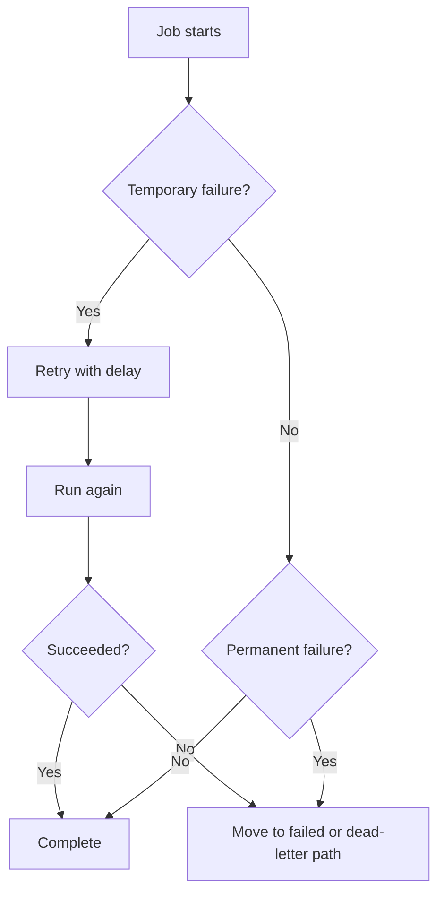
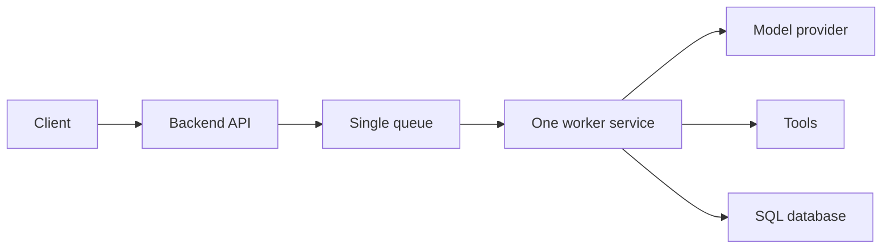

# Background Jobs and Queues

<div class="topic-page" markdown="1">

<section class="topic-hero">
  <span class="topic-hero__eyebrow">Stage 13 - Production Deployment</span>
  <p class="topic-hero__lead">Background jobs and queues let an AI agent do slow or heavy work without making the user wait on one long HTTP request. They are the production pattern for research tasks, large document processing, report generation, retries, and approval-based workflows.</p>
  <div class="topic-hero__facts">
    <span>Async work</span>
    <span>Queues</span>
    <span>Workers</span>
    <span>Retries</span>
    <span>Job status</span>
  </div>
</section>

## Goal

Understand background jobs and queues for AI agents in a simple, beginner-friendly way.

After this lesson, you should be able to explain:

- why some agent tasks should not run inside one API request,
- what a queue and worker do,
- how a job moves from queued to completed,
- how retries, failures, and timeouts work,
- how users check progress safely.

## Quick Summary

Use this table first.

| Part | Simple Meaning | Why It Matters |
| --- | --- | --- |
| API request | starts the work | gives the client an entry point |
| Queue | waiting line for jobs | smooths out bursts of work |
| Worker | background process that does the job | handles slow tasks |
| Job status | current progress | helps users track work |
| Retry rule | try again on temporary failure | improves reliability |
| Dead-letter path | place for broken jobs | prevents infinite failure loops |

Beginner rule:

```text
If a task is slow, expensive, or multi-step,
do not trap it inside one API request.
```

## Before You Start

Start with one simple idea:

```text
Synchronous means:
  the user waits now

Asynchronous means:
  the system works now
  the user checks later
```

Example:

```text
Good sync task:
  "Answer this short question"

Good async task:
  "Read 300 files and generate a weekly report"
```

### Key Words In Plain English

| Word | Simple Meaning | Beginner Example |
| --- | --- | --- |
| Job | one unit of background work | generate a report |
| Queue | waiting list of jobs | jobs line up here |
| Worker | program that takes jobs from queue | one worker processes one job |
| Retry | try again after failure | model API timed out |
| Timeout | stop a job if it takes too long | cancel after 10 minutes |
| Dead-letter queue | store failed jobs safely | inspect broken tasks later |
| Polling | client checks job status repeatedly | `GET /jobs/{id}` |
| Webhook | system notifies client later | "job completed" callback |

## Learning Path

This topic is designed in four parts. Read them in order.

<div class="learning-grid learning-grid--path">
  <a class="learning-card" href="#part-1-understand-why-background-jobs-exist">
    <strong>Part 1 - Understand Why Background Jobs Exist</strong>
    <span>Learn why long AI work should leave the request-response path.</span>
  </a>
  <a class="learning-card" href="#part-2-follow-the-job-lifecycle">
    <strong>Part 2 - Follow The Job Lifecycle</strong>
    <span>See how a job moves through API, queue, worker, and result store.</span>
  </a>
  <a class="learning-card" href="#part-3-make-jobs-reliable">
    <strong>Part 3 - Make Jobs Reliable</strong>
    <span>Handle retries, timeouts, duplicate requests, and failed jobs.</span>
  </a>
  <a class="learning-card" href="#part-4-start-simple-in-production">
    <strong>Part 4 - Start Simple In Production</strong>
    <span>Use a small architecture first and add complexity only when needed.</span>
  </a>
</div>

## Part 1: Understand Why Background Jobs Exist

Some AI agent tasks are too slow for one normal API request.

Examples:

- deep research across many pages,
- large file summarization,
- report generation,
- many tool calls,
- workflows that pause for approval,
- batch processing of many items.

Simple definition:

```text
A background job is work that starts from a request
but finishes outside that request.
```

### The Big Picture



**How to read this diagram:** the user asks once, the API creates a job, the queue holds it, a worker does the work, and the user checks status later.

### Why Not Keep Everything Synchronous?

| Problem | What Goes Wrong |
| --- | --- |
| Long model calls | request times out |
| Many tool calls | user waits too long |
| Traffic spikes | API becomes overloaded |
| Temporary provider failure | whole request fails immediately |
| Approval pauses | request cannot stay open forever |

### Sync vs Async Table

| Task Type | Better Choice | Reason |
| --- | --- | --- |
| short answer | sync | user expects instant result |
| quick search and summary | sync | small and fast |
| long report generation | async | too slow for one request |
| many-document analysis | async | large and expensive |
| approval-based send action | async | may wait on human |

## Part 2: Follow The Job Lifecycle

Background systems become easy to understand when you follow one job.

### Example Scenario

User asks:

```text
Generate a weekly support report from all tickets, summarize major problems,
and send a draft to my dashboard.
```

### Job Lifecycle Diagram

```mermaid
flowchart TD
    A[Client sends POST /jobs] --> B[API validates input]
    B --> C[Job record created]
    C --> D[Job placed in queue]
    D --> E[Worker picks job]
    E --> F[Worker loads data]
    F --> G[Worker calls model and tools]
    G --> H[Worker stores result]
    H --> I[Job marked completed]
    I --> J[Client polls GET /jobs/{id}]
```

### Job Lifecycle Table

| Step | What Happens | Why It Matters |
| --- | --- | --- |
| 1 | API receives request | begins the workflow |
| 2 | input is validated | blocks bad jobs early |
| 3 | job record is created | gives tracking ID |
| 4 | queue stores the job | buffers work safely |
| 5 | worker picks the job | starts execution |
| 6 | worker runs model and tools | does the real work |
| 7 | result is stored | client can fetch output |
| 8 | status is updated | user sees progress |

### Common Job Status Values

| Status | Meaning |
| --- | --- |
| `queued` | waiting in line |
| `running` | worker is processing it |
| `waiting_for_approval` | paused for a human |
| `completed` | finished successfully |
| `failed` | stopped with an error |
| `cancelled` | stopped intentionally |

### Status State Diagram



### Example API Pattern

Create job:

```json
{
  "task": "Generate weekly support report",
  "workspace_id": "team_42"
}
```

Immediate response:

```json
{
  "job_id": "job_123",
  "status": "queued"
}
```

Check status later:

```json
{
  "job_id": "job_123",
  "status": "running",
  "progress": 60
}
```

Final result:

```json
{
  "job_id": "job_123",
  "status": "completed",
  "result": {
    "summary": "Top issues were login failures, billing confusion, and search latency.",
    "artifact_url": "/artifacts/job_123/report.html"
  }
}
```

## Part 3: Make Jobs Reliable

Production job systems fail in real life. The design must expect failure.

### Common Failure Points

| Failure Point | Example |
| --- | --- |
| model timeout | provider is slow |
| tool failure | search API is down |
| worker crash | process exits during job |
| duplicate request | client retries same `POST /jobs` |
| stuck queue | too many waiting jobs |
| bad job payload | missing required data |

### Reliability Diagram



### Retry Rules

| Rule | Why It Helps |
| --- | --- |
| retry only temporary failures | avoid wasting resources |
| use retry limits | stop infinite loops |
| wait longer between retries | reduces pressure on failing service |
| log each retry | easier debugging |

### Timeout, Retry, And Dead-Letter Table

| Mechanism | Purpose | Beginner Meaning |
| --- | --- | --- |
| timeout | stop runaway work | "this job took too long" |
| retry | recover from short failures | "try again later" |
| dead-letter queue | isolate broken jobs | "set this aside for inspection" |

### Idempotency Example

Problem:

```text
Client sends POST /jobs
Network fails before client sees the response
Client retries
Two identical jobs are created
```

Better design:

```text
Client sends an idempotency key
Server sees the same key again
Server returns the first job instead of creating another
```

### Progress And User Experience

Users should not feel blind while a background job runs.

| Good UX Choice | Why It Helps |
| --- | --- |
| return `job_id` immediately | user can track work |
| expose status endpoint | client can poll |
| expose progress when possible | user sees movement |
| store final artifacts | user can fetch output later |
| return clear failure reason | easier recovery |

## Part 4: Start Simple In Production

Do not begin with a giant distributed system if you do not need one.

### Beginner Architecture



This is often enough for an early production system.

### Start Simple Table

| Layer | Simple Starting Choice |
| --- | --- |
| API | one backend service |
| Queue | one queue |
| Workers | one worker type |
| Storage | one SQL database |
| Status tracking | `GET /jobs/{id}` |
| Notifications | polling first, webhook later |

### When To Add More Complexity

| Signal | Possible Upgrade |
| --- | --- |
| too many queued jobs | add more workers |
| one job type blocks others | split queues by job type |
| retries become noisy | improve retry rules |
| one worker does too much | separate worker roles |
| users need live updates | add webhooks or streaming events |

### Beginner Rules

```text
1. Put slow work in background jobs.
2. Return a job ID quickly.
3. Track status clearly.
4. Retry only when the failure is temporary.
5. Stop failed jobs from looping forever.
```

## Summary

Use this table to remember the main ideas.

| Main Idea | Short Meaning |
| --- | --- |
| background jobs protect the API | slow work leaves the request path |
| queues smooth work | jobs wait safely |
| workers do the actual task | model and tools run in background |
| status tracking matters | users must see progress |
| retries and timeouts improve reliability | failures are normal in production |
| simple architecture is enough at first | add complexity only when needed |

## Practice

1. Name three agent tasks that should use background jobs.
2. Explain the difference between a queue and a worker.
3. Explain why `POST /jobs` and `GET /jobs/{id}` work well together.
4. Describe one temporary failure and one permanent failure.

## Mini Project

Design a background-job system for an AI research assistant.

Include:

- one endpoint to start the job,
- one endpoint to check status,
- status values,
- retry rule,
- timeout rule,
- result format.

Then answer:

1. Which work happens in the API?
2. Which work happens in the worker?
3. What should happen if the model provider times out?

## Exit Criteria

You are ready to move on when you can:

- explain why background jobs are useful,
- describe the job lifecycle from API to worker to result,
- explain queue, worker, retry, timeout, and dead-letter concepts,
- design a simple job-status API for an AI agent system.

## Resources

- [FastAPI - Background Tasks](https://fastapi.tiangolo.com/tutorial/background-tasks/)
- [Celery Documentation](https://docs.celeryq.dev/en/stable/)
- [RQ Documentation](https://python-rq.org/)
- [RabbitMQ Tutorials](https://www.rabbitmq.com/tutorials)
- [Redis Documentation](https://redis.io/docs/latest/)

</div>
