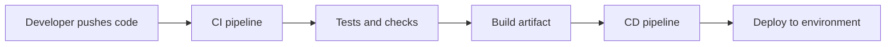
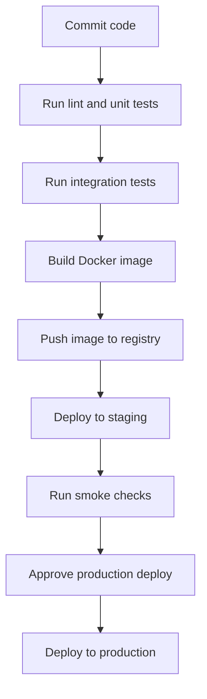
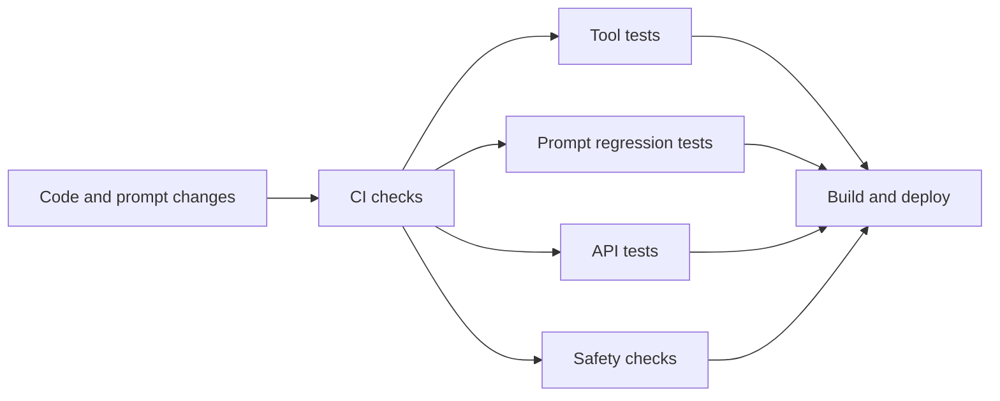
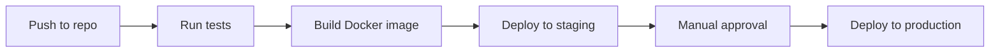

# CI/CD

<div class="topic-page" markdown="1">

<section class="topic-hero">
  <span class="topic-hero__eyebrow">Stage 13 - Production Deployment</span>
  <p class="topic-hero__lead">CI/CD is the delivery pipeline that moves an AI agent system from code changes to tested releases in production. It helps teams automate checks, package the app, deploy safely, and reduce the chance that a small change breaks the live system.</p>
  <div class="topic-hero__facts">
    <span>Automation</span>
    <span>Testing</span>
    <span>Builds</span>
    <span>Deployments</span>
    <span>Rollbacks</span>
  </div>
</section>

## Goal

Understand CI/CD for AI agent deployment in a simple, beginner-friendly way.

After this lesson, you should be able to explain:

- what CI and CD mean,
- why automation matters in production,
- how code moves from commit to deployment,
- what tests and checks usually run,
- why agent systems need safe release steps,
- how rollback fits into deployment.

## Quick Summary

Use this table first.

| Part | Simple Meaning | Why It Matters |
| --- | --- | --- |
| CI | automatically check code changes | catches problems early |
| CD | automatically deliver changes | reduces manual release work |
| Build | package the app | prepares deployable artifact |
| Test | verify behavior | protects quality |
| Deploy | release to an environment | updates the running system |
| Rollback | return to previous version | reduces production risk |

Beginner rule:

```text
Good CI/CD is not only about speed.
It is about safer change.
```

## Before You Start

Start with one simple idea:

```text
Every production change carries risk.
CI/CD reduces that risk by making changes repeatable and testable.
```

Example:

```text
Without CI/CD:
  developer changes code
  someone deploys manually
  steps are inconsistent

With CI/CD:
  code is checked automatically
  build is created automatically
  deployment follows a standard path
```

### Key Words In Plain English

| Word | Simple Meaning | Beginner Example |
| --- | --- | --- |
| Pipeline | ordered automation steps | test -> build -> deploy |
| CI | Continuous Integration | run checks on each commit |
| CD | Continuous Delivery or Deployment | move approved changes toward production |
| Artifact | packaged output of the build | Docker image |
| Environment | place where the app runs | dev, staging, production |
| Rollback | go back to last good release | restore earlier container image |
| Gate | a required checkpoint | tests must pass before deploy |

## Learning Path

This topic is designed in four parts. Read them in order.

<div class="learning-grid learning-grid--path">
  <a class="learning-card" href="#part-1-understand-what-cicd-does">
    <strong>Part 1 - Understand What CI/CD Does</strong>
    <span>Learn the job of CI/CD in a production AI system.</span>
  </a>
  <a class="learning-card" href="#part-2-follow-the-release-pipeline">
    <strong>Part 2 - Follow The Release Pipeline</strong>
    <span>See how code changes move from commit to production.</span>
  </a>
  <a class="learning-card" href="#part-3-add-agent-specific-checks">
    <strong>Part 3 - Add Agent-Specific Checks</strong>
    <span>Protect prompts, tools, and model behavior before release.</span>
  </a>
  <a class="learning-card" href="#part-4-release-safely-and-simply">
    <strong>Part 4 - Release Safely And Simply</strong>
    <span>Use staging, approvals, and rollbacks to reduce risk.</span>
  </a>
</div>

## Part 1: Understand What CI/CD Does

CI/CD is the system that helps teams release software consistently.

Simple definitions:

```text
CI = automatically test and check code changes

CD = automatically deliver or deploy checked changes
```

### The Big Picture



**How to read this diagram:** a code change triggers automation. The system checks the change, packages it, and deploys it in a controlled way.

### Why AI Agent Systems Need CI/CD

| Problem Without CI/CD | How CI/CD Helps |
| --- | --- |
| manual releases differ each time | standard deployment steps |
| broken code reaches production | tests stop bad changes |
| prompt or tool changes are hard to trace | pipeline records what changed |
| deployment takes too long | automation reduces repetitive work |
| rollback is confusing | previous artifacts stay available |

### CI vs CD

| CI | CD |
| --- | --- |
| checks code changes | ships approved changes |
| usually runs on each push or pull request | usually runs after CI passes |
| includes lint, tests, build checks | includes deploy, verify, rollback path |

## Part 2: Follow The Release Pipeline

It is easier to understand CI/CD by following one change.

### Example Scenario

Suppose you update:

- the agent prompt,
- one tool function,
- the API route for job status.

### Pipeline Diagram



### Pipeline Table

| Step | What Happens | Why It Matters |
| --- | --- | --- |
| 1 | code is pushed | starts automation |
| 2 | CI runs checks | stops obvious issues |
| 3 | image is built | creates deployable artifact |
| 4 | image is stored | keeps a versioned release |
| 5 | staging deploy runs | tests in near-real environment |
| 6 | smoke checks run | confirm service starts correctly |
| 7 | production deploy runs | release reaches users |

### Common Environments

| Environment | Purpose |
| --- | --- |
| local | developer testing |
| CI | automated checks |
| staging | pre-production verification |
| production | live user traffic |

### Simple Release Flow

```text
write code
-> run CI checks
-> build artifact
-> deploy to staging
-> verify
-> deploy to production
```

## Part 3: Add Agent-Specific Checks

AI agent systems need normal software checks and agent-specific checks.

### Standard Software Checks

| Check | Purpose |
| --- | --- |
| formatting or linting | catch style and simple mistakes |
| unit tests | verify small code parts |
| integration tests | verify services work together |
| build test | ensure deployable artifact can be created |

### Agent-Specific Checks

| Check | Why It Matters For Agents |
| --- | --- |
| prompt regression tests | catch quality drops after prompt edits |
| tool contract tests | verify tool inputs and outputs stay stable |
| API schema checks | stop breaking client integrations |
| safety tests | catch risky or blocked behavior |
| cost and latency checks | detect expensive or slow changes |

### Agent Release Diagram



### Why Prompt Changes Need Process

A prompt change may:

- increase cost,
- slow down responses,
- break output format,
- cause worse tool selection,
- reduce answer quality.

So prompts should move through CI/CD like code changes do.

### Example Release Checklist

| Item | Check |
| --- | --- |
| code compiles or runs | yes |
| unit tests pass | yes |
| key agent flows still work | yes |
| output format is unchanged | yes |
| cost did not spike badly | yes |
| rollback plan exists | yes |

## Part 4: Release Safely And Simply

Beginner teams should not start with a complex deployment system.

Start with a small, clear pipeline.

### Beginner Pipeline Shape



### Safe Release Rules

| Rule | Why It Helps |
| --- | --- |
| deploy to staging first | catches issues before users see them |
| keep build and deploy steps repeatable | reduces manual mistakes |
| require key checks before deploy | adds safety gates |
| keep previous release available | enables rollback |
| monitor after deployment | catches live issues quickly |

### Rollback In Plain Language

Rollback means:

```text
the new release is bad
go back to the last known good release
```

### Common Deployment Strategies

| Strategy | Simple Meaning | Beginner View |
| --- | --- | --- |
| direct replace | old version replaced by new one | simplest |
| blue-green | two environments, switch traffic | safer but more setup |
| canary | small traffic goes to new version first | useful for risk control |

For a beginner roadmap, the main lesson is simple:

```text
Always know how you will undo a bad release.
```

### Common Beginner Mistakes

| Mistake | Better Approach |
| --- | --- |
| deploying directly from laptop | use pipeline automation |
| no staging environment | add at least one pre-prod check environment |
| no tests before deploy | add basic CI gates |
| changing prompts without review | treat prompt changes like code changes |
| no rollback plan | keep previous artifact ready |

## Summary

Use this table to remember the main ideas.

| Main Idea | Short Meaning |
| --- | --- |
| CI checks changes automatically | catches problems early |
| CD delivers changes consistently | safer releases |
| pipeline turns change into release | standard path from commit to production |
| AI agents need extra checks | prompts, tools, safety, cost |
| staging and rollback reduce risk | bad releases are easier to control |

## Practice

1. Explain the difference between CI and CD.
2. Name three checks that should run before production deploy.
3. Explain why prompt changes should go through the pipeline.
4. Explain rollback in one sentence.

## Mini Project

Design a CI/CD pipeline for an AI support assistant.

Include:

- one CI stage,
- one build stage,
- one staging deploy stage,
- one production deploy stage,
- one rollback plan.

Then answer:

1. Which tests are normal software tests?
2. Which tests are agent-specific?
3. What should block a production deploy?

## Exit Criteria

You are ready to move on when you can:

- explain CI and CD in plain language,
- describe the main pipeline from commit to deployment,
- name common checks for an AI agent system,
- explain staging, approval, and rollback clearly.

## Resources

- [GitHub Actions - Understanding GitHub Actions](https://docs.github.com/actions/learn-github-actions/understanding-github-actions)
- [GitLab CI/CD - What is CI/CD?](https://about.gitlab.com/topics/ci-cd/)
- [Docker Docs - Dockerfile Reference](https://docs.docker.com/reference/dockerfile/)
- [OWASP - CI/CD Security Cheat Sheet](https://cheatsheetseries.owasp.org/cheatsheets/CI_CD_Security_Cheat_Sheet.html)

</div>
