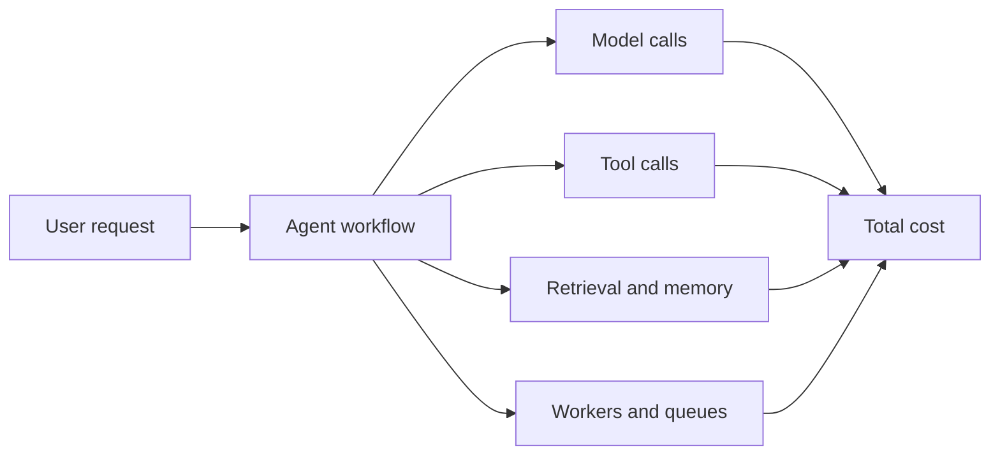
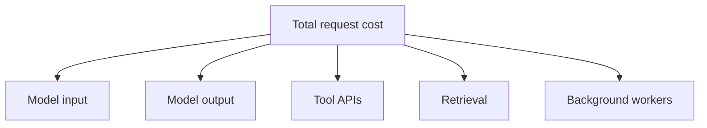
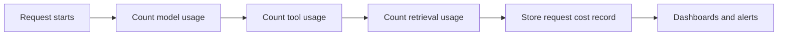
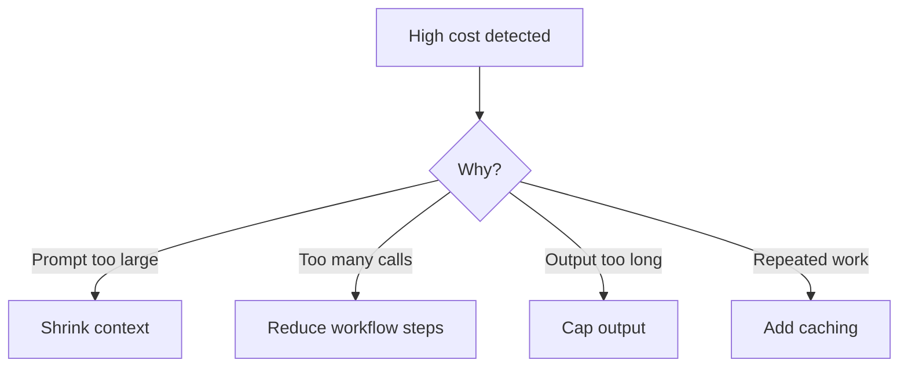
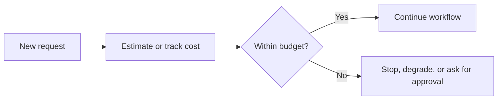

# Cost Control

<div class="topic-page" markdown="1">

<section class="topic-hero">
  <span class="topic-hero__eyebrow">Stage 13 - Production Deployment</span>
  <p class="topic-hero__lead">Cost control is the practice of understanding, measuring, and reducing how much an AI agent system spends in production. It matters because agent systems can become expensive quickly through large prompts, long outputs, repeated tool calls, retrieval steps, retries, and background jobs.</p>
  <div class="topic-hero__facts">
    <span>Tokens</span>
    <span>Tool costs</span>
    <span>Budgets</span>
    <span>Caching</span>
    <span>Monitoring</span>
  </div>
</section>

## Goal

Understand cost control for AI agent systems in a simple, beginner-friendly way.

After this lesson, you should be able to explain:

- where AI agent costs come from,
- why agents can cost more than a single LLM call,
- how to measure cost in production,
- how to reduce cost without breaking quality,
- how budgets, limits, and alerts help.

## Quick Summary

Use this table first.

| Cost Area | Simple Meaning | Why It Matters |
| --- | --- | --- |
| input tokens | tokens sent to the model | part of model billing |
| output tokens | tokens generated by the model | also billed and often slower |
| tool calls | external actions and APIs | can add direct or indirect cost |
| retrieval | search or vector lookups | may add database and compute cost |
| retries and loops | repeated work | can multiply spending |
| budgets and limits | spending boundaries | prevent runaway usage |

Beginner rule:

```text
The cheapest agent is not always the best.
The goal is useful output at controlled cost.
```

## Before You Start

Start with one simple idea:

```text
An agent usually costs more than one model call
because it can call the model many times
and can also call tools, memory, and workers.
```

Example:

```text
Single chatbot answer:
  1 model call

Research agent:
  1 routing call
  1 retrieval step
  3 reasoning calls
  2 tool calls
  1 final answer
```

### Key Words In Plain English

| Word | Simple Meaning | Beginner Example |
| --- | --- | --- |
| Token cost | model price based on token usage | input + output billing |
| Budget | spending limit | daily team budget |
| Quota | allowed amount of usage | 100 runs per user |
| Cache | reuse earlier work | reuse retrieved context |
| Retry | try again after failure | model timeout retry |
| Cost anomaly | unusual spending spike | token cost doubled today |
| Unit cost | cost per action | cost per job or request |

## Learning Path

This topic is designed in four parts. Read them in order.

<div class="learning-grid learning-grid--path">
  <a class="learning-card" href="#part-1-understand-where-cost-comes-from">
    <strong>Part 1 - Understand Where Cost Comes From</strong>
    <span>Learn the main cost sources in an AI agent system.</span>
  </a>
  <a class="learning-card" href="#part-2-measure-cost-in-production">
    <strong>Part 2 - Measure Cost In Production</strong>
    <span>Track cost by request, job, user, tool, and workflow.</span>
  </a>
  <a class="learning-card" href="#part-3-reduce-cost-without-losing-quality">
    <strong>Part 3 - Reduce Cost Without Losing Quality</strong>
    <span>Use practical cost-reduction patterns for prompts, tools, and flows.</span>
  </a>
  <a class="learning-card" href="#part-4-control-spending-with-rules">
    <strong>Part 4 - Control Spending With Rules</strong>
    <span>Apply budgets, quotas, alerts, and fallbacks.</span>
  </a>
</div>

## Part 1: Understand Where Cost Comes From

Production AI cost is broader than just one API bill.

Simple definition:

```text
Cost control means measuring where spending comes from
and setting rules so it stays acceptable.
```

### The Big Picture



**How to read this diagram:** many parts of an agent workflow add cost. The total is the sum of all of them, not only the final answer.

### Main Cost Sources

| Cost Source | Example |
| --- | --- |
| model input tokens | long prompts, history, retrieved context |
| model output tokens | long answers, verbose reasoning |
| repeated model calls | planner, evaluator, retry loops |
| tool usage | search APIs, web APIs, paid services |
| retrieval systems | vector database or search infrastructure |
| background processing | workers running long jobs |

### Why Agents Can Become Expensive Fast

| Pattern | Why Cost Increases |
| --- | --- |
| too much history | more input tokens every turn |
| very large retrieval context | bigger prompts |
| retry loops | same work happens again |
| multi-step architectures | many model calls per request |
| unnecessary tool use | extra API and compute cost |

### Simple Cost Chart



## Part 2: Measure Cost In Production

If you do not measure cost clearly, you cannot control it.

### What To Track

| Track By | Why It Helps |
| --- | --- |
| request | shows cost per API call |
| job | shows cost for long workflows |
| user | shows heavy usage patterns |
| workspace or customer | supports billing and limits |
| tool | finds expensive integrations |
| model | compares provider cost behavior |

### Cost Tracking Table

| Signal | Example |
| --- | --- |
| input tokens | 4,200 |
| output tokens | 380 |
| model name | `gpt-4o` |
| tool calls | 3 |
| job duration | 95 seconds |
| estimated request cost | `$0.08` |

### Cost Tracking Diagram



### Good Cost Questions

Your production system should help answer:

- Which workflows are most expensive?
- Which users or teams use the most tokens?
- Did cost spike after a prompt change?
- Did one tool suddenly become very expensive?
- Which jobs produce poor value for their cost?

## Part 3: Reduce Cost Without Losing Quality

Cheap but bad outputs are not useful. The real goal is cost efficiency.

### Common Cost Reduction Patterns

| Pattern | How It Saves Cost |
| --- | --- |
| shorter prompts | fewer input tokens |
| smaller context | lower prompt size |
| summarizing history | reduces carried-forward tokens |
| limiting output length | fewer output tokens |
| caching results | avoids repeat work |
| routing simple tasks to cheaper models | reduces average cost |
| stopping bad loops early | avoids runaway spending |

### Cost Reduction Diagram



### Example: Before And After

| Version | Workflow | Estimated Cost Effect |
| --- | --- | --- |
| before | send full history + 10 passages + long answer | high |
| after | summarize history + top 3 passages + capped answer | lower |

### Model Routing Example

```text
simple classification -> smaller or cheaper model
hard reasoning task -> stronger model
```

This pattern avoids using the most expensive model for every request.

### Beginner Rule For Saving Money

```text
Do not optimize blindly.
Measure first, then reduce the largest waste.
```

## Part 4: Control Spending With Rules

Production systems need rules, not only advice.

### Useful Cost Controls

| Control | Simple Meaning | Example |
| --- | --- | --- |
| per-request cap | stop one request from growing too much | max token budget |
| per-job cap | stop long workflows from running forever | max 20 steps |
| daily budget | stop overall spend from exploding | team daily spend cap |
| user quota | restrict heavy use | 50 research jobs per day |
| model fallback | switch to cheaper path when needed | lower-cost model on overload |
| alerting | warn on unusual spend | 2x daily average cost |

### Budget Flow Diagram



### Example Cost Policy

| Rule | Example |
| --- | --- |
| max tokens per request | 8,000 input + output |
| max steps per agent job | 12 |
| high-cost action | requires approval |
| cost alert | notify when daily spend > 120% of average |

### Common Beginner Mistakes

| Mistake | Better Approach |
| --- | --- |
| only watching monthly bill | track per-request and daily cost |
| no token logging | record usage systematically |
| using strongest model for everything | route by task difficulty |
| unlimited loops or retries | add hard caps |
| optimizing too early without data | measure biggest cost drivers first |

## Summary

Use this table to remember the main ideas.

| Main Idea | Short Meaning |
| --- | --- |
| agent cost comes from many layers | model, tools, retrieval, workers |
| measuring cost is required | you cannot control what you do not track |
| good cost control balances quality and price | cheapest is not always best |
| prompt, context, and workflow design matter | many costs come from architecture choices |
| budgets and alerts prevent surprises | rules reduce runaway spend |

## Practice

1. Name four sources of cost in an AI agent system.
2. Explain why a research agent costs more than a simple chatbot.
3. Name three ways to reduce cost without destroying quality.
4. Explain the difference between a budget and a quota.

## Mini Project

Design a cost-control plan for an AI research assistant.

Include:

- what to track per request,
- one daily budget,
- one per-job limit,
- one cost alert,
- one way to reduce context cost.

Then answer:

1. Which workflow part is most likely to become expensive?
2. What should happen if a job crosses its budget?
3. How would you detect a cost spike after a release?

## Exit Criteria

You are ready to move on when you can:

- explain the main cost sources in an AI agent system,
- describe how to measure production cost,
- name practical cost-reduction techniques,
- explain budgets, quotas, and cost alerts clearly.

## Resources

- [OpenAI API Pricing](https://openai.com/api/pricing/)
- [Anthropic Pricing](https://www.anthropic.com/pricing#api)
- [Google AI Pricing](https://ai.google.dev/gemini-api/docs/pricing)
- [LangSmith - Reduce Cost and Latency](https://docs.smith.langchain.com/evaluation/how_to_guides/compare_runs)

</div>
