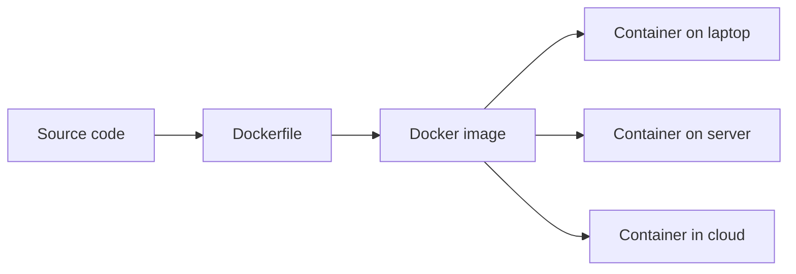
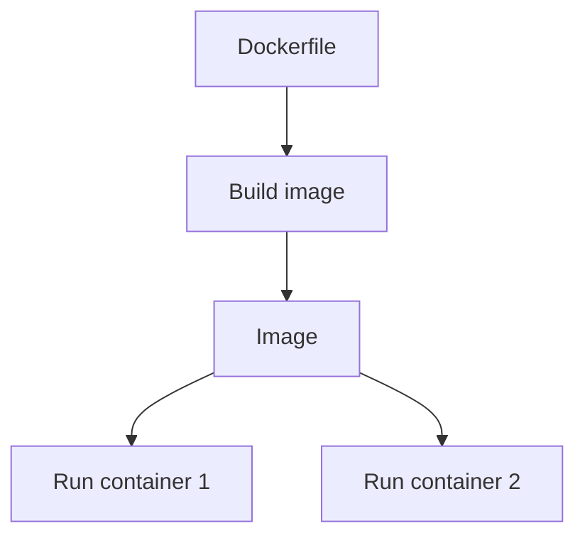
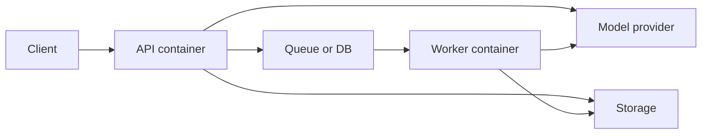
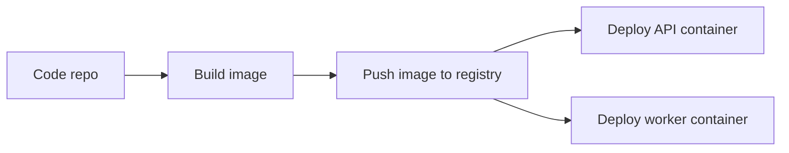

# Docker

<div class="topic-page" markdown="1">

<section class="topic-hero">
  <span class="topic-hero__eyebrow">Stage 13 - Production Deployment</span>
  <p class="topic-hero__lead">Docker is a packaging tool that helps you run the same AI agent application in development, testing, and production. It puts your app, dependencies, and runtime settings into a container so deployment becomes more predictable and easier to repeat.</p>
  <div class="topic-hero__facts">
    <span>Images</span>
    <span>Containers</span>
    <span>Dependencies</span>
    <span>Ports</span>
    <span>Deployment</span>
  </div>
</section>

## Goal

Understand Docker for AI agent deployment in a simple, beginner-friendly way.

After this lesson, you should be able to explain:

- what Docker is and why teams use it,
- the difference between an image and a container,
- how Docker helps package an AI agent app,
- what a basic `Dockerfile` does,
- how environment variables, ports, and volumes fit in,
- why Docker improves consistency between machines.

## Quick Summary

Use this short table first.

| Docker Part | Simple Meaning | Why It Matters |
| --- | --- | --- |
| Image | packaged blueprint | defines how the app should run |
| Container | running instance of the image | runs the app consistently |
| Dockerfile | instructions to build the image | makes packaging repeatable |
| Port mapping | route traffic in and out | exposes the API |
| Environment variables | settings outside the code | keeps secrets and config separate |
| Volume | shared storage | keeps files outside the container |

Beginner rule:

```text
Docker does not deploy your AI agent by itself.
Docker makes the agent easier to package and run.
```

## Before You Start

Start with one simple idea:

```text
"It works on my machine" is not enough in production.
Docker helps teams run the same packaged app everywhere.
```

Example:

```text
Without Docker:
  Python version differs
  package versions differ
  setup steps differ

With Docker:
  one image defines the runtime setup
```

### Key Words In Plain English

| Word | Simple Meaning | Beginner Example |
| --- | --- | --- |
| Dockerfile | recipe for the image | install Python packages and start server |
| Image | saved package of app + runtime | API service image |
| Container | running copy of the image | live backend process |
| Registry | place to store images | Docker Hub or private registry |
| Port | network entry point | app listens on `8000` |
| Volume | mounted storage | save logs or uploaded files |
| Env var | external configuration | `OPENAI_API_KEY` |

## Learning Path

This topic is designed in four parts. Read them in order.

<div class="learning-grid learning-grid--path">
  <a class="learning-card" href="#part-1-understand-what-docker-solves">
    <strong>Part 1 - Understand What Docker Solves</strong>
    <span>Learn why packaging matters in production AI systems.</span>
  </a>
  <a class="learning-card" href="#part-2-learn-images-containers-and-dockerfiles">
    <strong>Part 2 - Learn Images, Containers, And Dockerfiles</strong>
    <span>See the basic Docker building blocks in plain language.</span>
  </a>
  <a class="learning-card" href="#part-3-connect-docker-to-ai-agent-apps">
    <strong>Part 3 - Connect Docker To AI Agent Apps</strong>
    <span>Package an API, worker, and config for a real AI system.</span>
  </a>
  <a class="learning-card" href="#part-4-use-docker-safely-and-simply">
    <strong>Part 4 - Use Docker Safely And Simply</strong>
    <span>Start small and avoid common beginner mistakes.</span>
  </a>
</div>

## Part 1: Understand What Docker Solves

Production deployment needs consistency.

If your AI agent works on one laptop but fails on the server because the Python version, packages, or OS libraries differ, deployment becomes fragile.

Simple definition:

```text
Docker packages an application and its runtime
so it can run more consistently across environments.
```

### The Big Picture



**How to read this diagram:** one image can be built once and run in many places. That reduces setup differences.

### Why AI Agent Systems Use Docker

| Problem Without Docker | How Docker Helps |
| --- | --- |
| different Python versions | image defines the runtime |
| missing packages | dependencies are built into image |
| inconsistent startup steps | container uses standard start command |
| hard handoff to operations | image is a clear deployment unit |
| API and worker need same codebase | same image can run different commands |

### Docker Is Useful, But Not Magic

Docker helps with packaging, but it does not solve everything.

| Docker Helps With | Docker Does Not Automatically Solve |
| --- | --- |
| consistent runtime | app bugs |
| repeatable setup | model quality |
| easier deployment handoff | security by default |
| local-to-server similarity | scaling strategy |

## Part 2: Learn Images, Containers, And Dockerfiles

These three ideas are the core of Docker.

### Image vs Container

| Term | Simple Meaning | Real-World Analogy |
| --- | --- | --- |
| Image | saved package blueprint | recipe or blueprint |
| Container | running copy of the image | cooked meal or built house |

### Image And Container Diagram



### What A Dockerfile Does

A `Dockerfile` is a text file that says:

- which base image to start from,
- which files to copy,
- which packages to install,
- which command to run when the container starts.

### Simple Dockerfile Example

```dockerfile
FROM python:3.11-slim

WORKDIR /app

COPY requirements.txt .
RUN pip install --no-cache-dir -r requirements.txt

COPY . .

CMD ["uvicorn", "app.main:app", "--host", "0.0.0.0", "--port", "8000"]
```

### Dockerfile Table

| Line | Meaning |
| --- | --- |
| `FROM` | choose a base runtime |
| `WORKDIR` | set working folder inside container |
| `COPY` | move files into image |
| `RUN` | execute build step |
| `CMD` | default startup command |

## Part 3: Connect Docker To AI Agent Apps

AI agent systems often have more than one process.

Examples:

- API server,
- background worker,
- scheduled job,
- monitoring sidecar.

### Common Production Shape



### What Usually Goes Into The Container

| Included In Image | Usually Not Hardcoded In Image |
| --- | --- |
| application code | API keys |
| Python packages | production secrets |
| system dependencies | environment-specific URLs |
| startup command | live user data |

### Environment Variables In AI Systems

Use environment variables for settings like:

- `OPENAI_API_KEY`
- `ANTHROPIC_API_KEY`
- `DATABASE_URL`
- `REDIS_URL`
- `APP_ENV`

Beginner rule:

```text
Do not bake secrets directly into the image.
Pass them in at runtime.
```

### Ports And Traffic

If your app listens on port `8000` inside the container, Docker can map that to a host port.

Example:

```text
container port 8000 -> host port 8000
```

That allows browsers or other services to call the API.

### Volumes And Persistent Data

Containers are often treated as replaceable.

That means:

```text
important data should not live only inside the container filesystem
```

Use a database, object store, or mounted volume for persistent data.

| Good For Container Filesystem | Better Outside Container |
| --- | --- |
| temporary cache | user uploads |
| runtime scratch files | database data |
| short-lived artifacts | long-term reports |

### Example Deployment Split

| Container | Job |
| --- | --- |
| API container | handles HTTP requests |
| Worker container | processes background jobs |
| Database container in dev | local testing only |
| Managed database in prod | persistent production data |

## Part 4: Use Docker Safely And Simply

Beginner teams often overcomplicate Docker early. Start with a small, clear setup.

### Beginner Deployment Diagram



### Practical Beginner Rules

| Rule | Why It Helps |
| --- | --- |
| use a small base image | keeps images lighter |
| pin important dependency versions | improves repeatability |
| keep one clear startup command per container | avoids confusion |
| separate config from code | easier deployment |
| rebuild instead of editing live containers | keeps systems reproducible |

### Common Beginner Mistakes

| Mistake | Better Approach |
| --- | --- |
| storing secrets in Dockerfile | use env vars or secret manager |
| using container filesystem as main storage | use database or mounted storage |
| one giant container for everything | split API and worker when needed |
| manually changing running container | rebuild and redeploy image |

### Simple Workflow Summary

```text
1. Write code
2. Write Dockerfile
3. Build image
4. Run container locally
5. Push image to registry
6. Deploy container in production
```

## Summary

Use this table to remember the main idea.

| Main Idea | Short Meaning |
| --- | --- |
| Docker packages the app | code and runtime move together |
| image is the blueprint | build once |
| container is the running app | run many times |
| Dockerfile defines the build | repeatable packaging |
| config should stay outside the image | safer and more flexible |
| persistent data should live elsewhere | containers can be replaced |

## Practice

1. Explain the difference between an image and a container.
2. Name three things that belong inside an image.
3. Name three things that should stay outside the image.
4. Explain why an AI API and worker may run as separate containers.

## Mini Project

Design a Docker setup for a simple AI support assistant.

Include:

- one API container,
- one worker container,
- environment variables,
- one external database,
- one queue or cache service.

Then answer:

1. What is built into the image?
2. What is passed at runtime?
3. Which data must stay outside the container filesystem?

## Exit Criteria

You are ready to move on when you can:

- explain Docker in plain language,
- distinguish image, container, and Dockerfile,
- describe how Docker packages an AI agent service,
- explain ports, env vars, and volumes,
- name common beginner mistakes in containerized deployment.

## Resources

- [Docker - What is a Container?](https://www.docker.com/resources/what-container/)
- [Docker Docs - Get Started](https://docs.docker.com/get-started/)
- [Docker Docs - Dockerfile Reference](https://docs.docker.com/reference/dockerfile/)
- [Docker Docs - Bind Mounts](https://docs.docker.com/engine/storage/bind-mounts/)
- [Docker Docs - Publishing and Exposing Ports](https://docs.docker.com/get-started/docker-concepts/running-containers/publishing-ports/)

</div>
