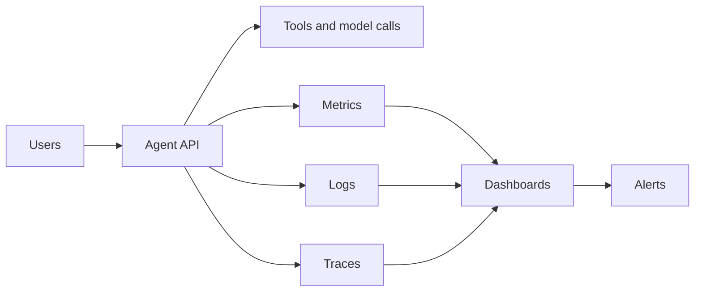
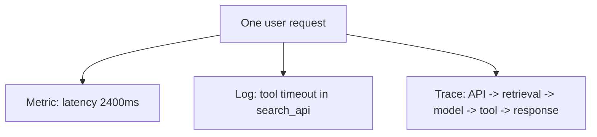
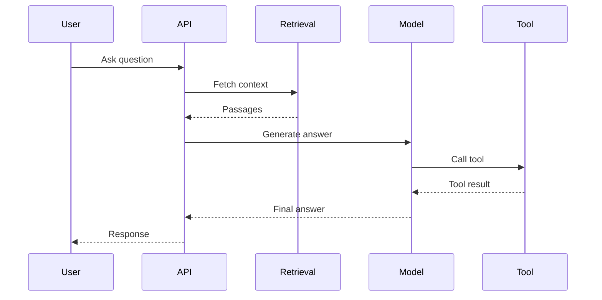
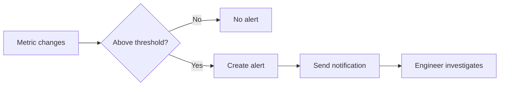
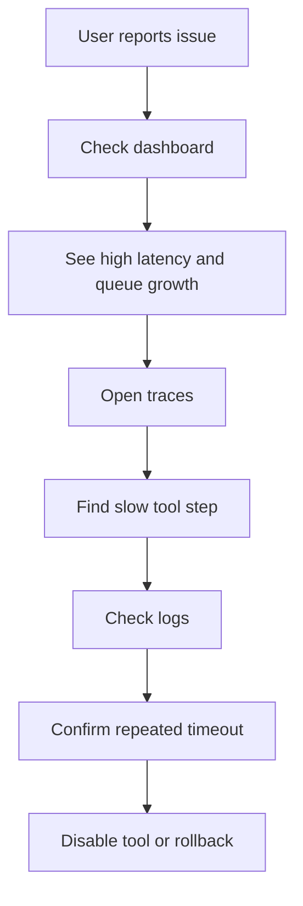

# Monitoring and Alerts

<div class="topic-page" markdown="1">

<section class="topic-hero">
  <span class="topic-hero__eyebrow">Stage 13 - Production Deployment</span>
  <p class="topic-hero__lead">Monitoring and alerts help you see what your AI agent system is doing after deployment. They show whether requests are slow, tools are failing, costs are rising, or the system is unhealthy, and they warn you early enough to respond before users are badly affected.</p>
  <div class="topic-hero__facts">
    <span>Metrics</span>
    <span>Logs</span>
    <span>Tracing</span>
    <span>Alerts</span>
    <span>Incidents</span>
  </div>
</section>

## Goal

Understand monitoring and alerts for AI agent systems in a simple, beginner-friendly way.

After this lesson, you should be able to explain:

- what monitoring is,
- why alerts matter in production,
- the difference between logs, metrics, and traces,
- which signals matter for AI agents,
- how to create useful alerts without too much noise,
- how monitoring supports debugging and incident response.

## Quick Summary

Use this table first.

| Part | Simple Meaning | Why It Matters |
| --- | --- | --- |
| Metrics | number-based signals | track speed, errors, and usage |
| Logs | detailed event records | explain what happened |
| Traces | end-to-end request journeys | show where time was spent |
| Dashboard | screen for system health | quick operational view |
| Alert | warning when something is wrong | helps teams react early |
| Incident | real production problem | needs response and recovery |

Beginner rule:

```text
If you cannot see what the system is doing,
you cannot operate it safely.
```

## Before You Start

Start with one simple idea:

```text
Development asks:
  "Does it work?"

Production asks:
  "Is it still working right now?"
```

Example:

```text
An agent may work well in testing,
but in production it may become slow,
start failing tool calls,
or cost much more than expected.
```

### Key Words In Plain English

| Word | Simple Meaning | Beginner Example |
| --- | --- | --- |
| Metric | measured number | request latency |
| Log | detailed event record | tool call failed |
| Trace | linked record of one request | full agent run timeline |
| Dashboard | visual overview | error rate chart |
| Alert | automatic warning | latency too high |
| Threshold | condition that triggers alert | error rate > 5% |
| Incident | important production failure | agent cannot answer users |

## Learning Path

This topic is designed in four parts. Read them in order.

<div class="learning-grid learning-grid--path">
  <a class="learning-card" href="#part-1-understand-what-to-watch">
    <strong>Part 1 - Understand What To Watch</strong>
    <span>Learn the main signals that matter in an AI system.</span>
  </a>
  <a class="learning-card" href="#part-2-learn-logs-metrics-and-traces">
    <strong>Part 2 - Learn Logs, Metrics, And Traces</strong>
    <span>See the three main observability views in plain language.</span>
  </a>
  <a class="learning-card" href="#part-3-design-useful-alerts">
    <strong>Part 3 - Design Useful Alerts</strong>
    <span>Create alerts that catch real problems without too much noise.</span>
  </a>
  <a class="learning-card" href="#part-4-use-monitoring-in-real-incidents">
    <strong>Part 4 - Use Monitoring In Real Incidents</strong>
    <span>Connect dashboards and alerts to production debugging and recovery.</span>
  </a>
</div>

## Part 1: Understand What To Watch

Production AI systems need active observation.

Simple definition:

```text
Monitoring means collecting signals from a live system
so you can understand health, failures, and performance.
```

### The Big Picture



**How to read this diagram:** the running system produces signals. Those signals feed dashboards and alerts so operators can see problems.

### What Matters Most In AI Agent Monitoring

| Signal | Why It Matters |
| --- | --- |
| latency | users care about speed |
| error rate | shows failed requests |
| tool failures | tools often break before the whole system does |
| model failures | provider errors affect agent behavior |
| token usage | affects cost and scale |
| queue backlog | shows worker pressure |
| approval wait time | affects long-running workflows |

### Common AI Production Questions

Monitoring should help answer:

- Are requests slower than normal?
- Are tool calls failing?
- Did a new release increase cost?
- Are workers keeping up with jobs?
- Are users seeing more failed responses?

## Part 2: Learn Logs, Metrics, And Traces

These three signals work together.

### Logs vs Metrics vs Traces

| Type | Simple Meaning | Best Use |
| --- | --- | --- |
| Metrics | number summaries over time | alerts and dashboards |
| Logs | detailed events | debugging exact failures |
| Traces | linked path of one request | finding slow or broken steps |

### Observability Diagram



### Metrics Examples

| Metric | Example |
| --- | --- |
| request latency | p50, p95 response time |
| request count | 2,000 requests per hour |
| error rate | 3% failed requests |
| token usage | 500k input tokens today |
| queue size | 120 waiting jobs |

### Logs Examples

Logs should help you inspect exact events.

Example log fields:

| Field | Example |
| --- | --- |
| `request_id` | `req_123` |
| `user_id` | `user_45` |
| `tool_name` | `search_docs` |
| `status` | `timeout` |
| `latency_ms` | `8000` |
| `model` | `gpt-4o` |

### Trace Example



Traces are useful when a request is slow but you do not know which step caused the delay.

## Part 3: Design Useful Alerts

Alerts should help humans act. Bad alerts create noise.

### Good Alert Design

| Good Alert Trait | Why It Helps |
| --- | --- |
| tied to a real problem | avoids noise |
| has a clear threshold | easier to reason about |
| tells who should care | faster response |
| points to next step | easier troubleshooting |

### Alert Examples

| Alert | Example Rule |
| --- | --- |
| high error rate | error rate > 5% for 10 minutes |
| high latency | p95 latency > 8 seconds |
| tool failure spike | tool failures doubled in 15 minutes |
| queue backlog | queued jobs > 500 |
| cost anomaly | daily token cost 2x normal |

### Alert Diagram



### Alert Noise vs Useful Alerts

| Too Noisy | Better |
| --- | --- |
| alert on every single failure | alert on sustained failure rate |
| no context in alert | include service, metric, threshold |
| same alert repeats every minute | group or suppress duplicates |

### Beginner Rule For Alerts

```text
Alert on symptoms that matter to users or operations,
not on every small technical event.
```

## Part 4: Use Monitoring In Real Incidents

Monitoring is not only for charts. It supports real incident response.

### Example Incident

Problem:

```text
Users report that the research agent is very slow.
```

Monitoring may show:

- p95 latency jumped from 4 seconds to 15 seconds,
- queue size is growing,
- one tool timeout rate is very high,
- worker CPU is normal,
- the issue started after a release.

This helps narrow the problem.

### Incident Investigation Flow



### Dashboard Suggestions

| Dashboard | What To Show |
| --- | --- |
| API health | request rate, latency, error rate |
| model usage | token usage, provider errors, cost |
| tool health | tool latency, tool failures |
| worker health | running jobs, queue size, retry count |
| business view | successful tasks, blocked tasks, approval delays |

### Beginner Monitoring Starter Pack

Start with these:

| Priority | Signal |
| --- | --- |
| high | request latency |
| high | error rate |
| high | request count |
| high | token cost |
| medium | queue size |
| medium | tool failure count |
| medium | model timeout count |

### Common Beginner Mistakes

| Mistake | Better Approach |
| --- | --- |
| no request IDs | add IDs for tracing |
| logs without structure | use structured fields |
| alerts on every exception | alert on sustained patterns |
| no cost tracking | monitor token usage and spend |
| only monitor API | also monitor tools, workers, and queues |

## Summary

Use this table to remember the main ideas.

| Main Idea | Short Meaning |
| --- | --- |
| monitoring gives visibility | you can see system health |
| metrics show numbers over time | useful for dashboards and alerts |
| logs show detailed events | useful for debugging |
| traces show request journeys | useful for finding slow steps |
| alerts must be actionable | useful alerts reduce noise |
| AI systems need extra signals | cost, tools, token usage, queues |

## Practice

1. Explain the difference between logs, metrics, and traces.
2. Name three alert conditions for an AI agent system.
3. Explain why request IDs help debugging.
4. Explain why cost monitoring matters for AI systems.

## Mini Project

Design a monitoring plan for an AI support assistant.

Include:

- five key metrics,
- two logs fields,
- one trace use case,
- three alerts,
- one dashboard for operators.

Then answer:

1. Which alert should wake a human quickly?
2. Which signals help explain slow responses?
3. Which signals help detect cost problems?

## Exit Criteria

You are ready to move on when you can:

- explain monitoring in plain language,
- distinguish metrics, logs, and traces,
- name important alerts for an AI agent system,
- describe how monitoring helps during an incident.

## Resources

- [OpenTelemetry - What is Observability?](https://opentelemetry.io/docs/concepts/observability-primer/)
- [Google SRE Book - Monitoring Distributed Systems](https://sre.google/sre-book/monitoring-distributed-systems/)
- [Prometheus - Overview](https://prometheus.io/docs/introduction/overview/)
- [Grafana - What is Observability?](https://grafana.com/observability/)

</div>
