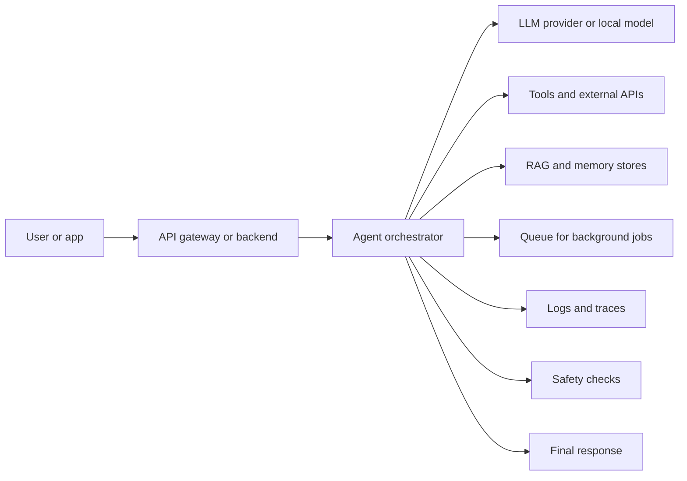
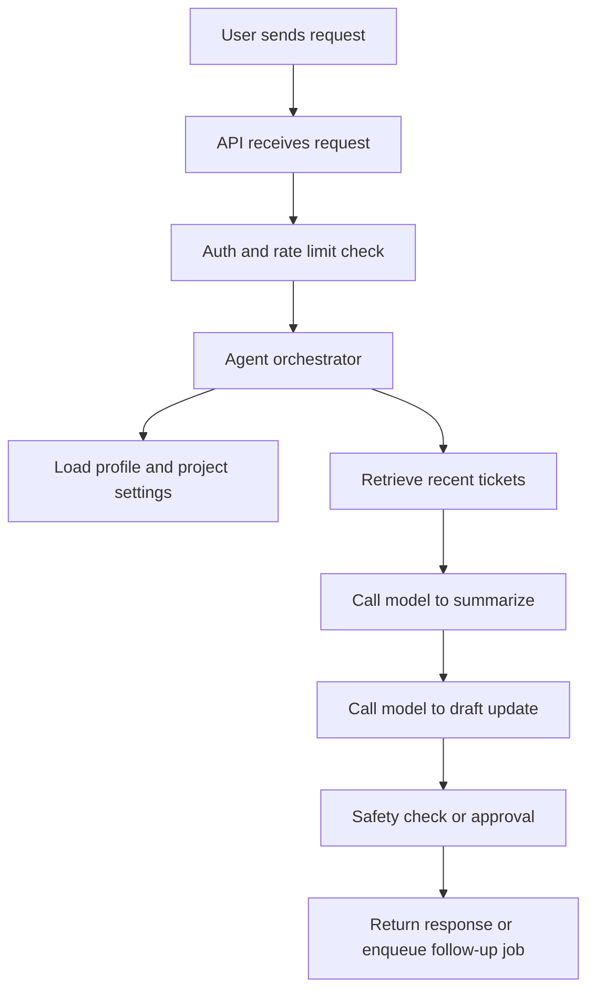
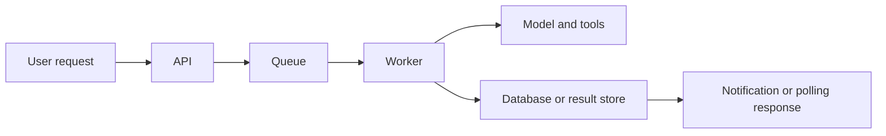
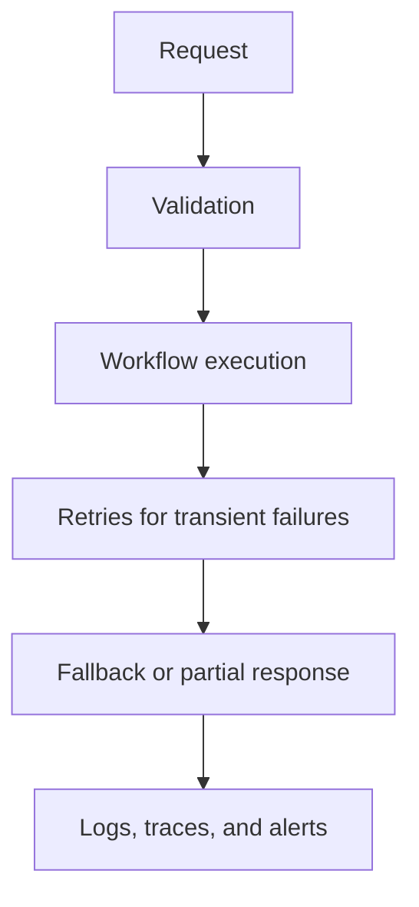
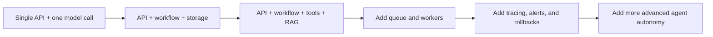

# Production Architecture

<div class="topic-page" markdown="1">

<section class="topic-hero">
  <span class="topic-hero__eyebrow">Stage 13 - Production Deployment</span>
  <p class="topic-hero__lead">Production architecture is the practical shape of a real AI agent system after it leaves the notebook and starts serving users. It defines how requests enter the system, how models and tools are called, where memory lives, how background jobs run, and how the system stays reliable, observable, and safe.</p>
  <div class="topic-hero__facts">
    <span>API layer</span>
    <span>Queues</span>
    <span>Memory stores</span>
    <span>Monitoring</span>
    <span>Rollbacks</span>
  </div>
</section>

## Goal

Understand the basic production architecture of AI agent systems in a simple, beginner-friendly way.

After this lesson, you should be able to explain:

- what production architecture means,
- what components a deployed agent system usually has,
- why production systems need more than just an LLM call,
- how API, memory, tools, queues, and monitoring fit together,
- when to use synchronous vs background work,
- what failure points to expect,
- how to design a simple but reliable deployment shape.

## Quick Summary

Use this table first. It gives the short version.

| Part | Simple Meaning | Why It Exists |
| --- | --- | --- |
| API | entry point for users or apps | receives requests |
| Orchestrator | control layer for the workflow | decides what steps run |
| Model layer | one or more LLM calls | reasoning and generation |
| Tool layer | external systems and APIs | lets the agent act |
| Memory layer | state, profiles, RAG, task data | keeps useful context |
| Queue and workers | background execution | handles long-running jobs |
| Monitoring | logs, metrics, alerts, traces | helps operate safely |
| Safety layer | validation, policy, approvals | reduces risk |

Beginner rule:

```text
A production agent is not just a prompt.
It is a software system around a prompt.
```

## Before You Start

Start with one simple idea:

```text
Prototype architecture asks:
  "Can this work?"

Production architecture asks:
  "Can this work reliably for real users?"
```

Example:

```text
Prototype:
  browser form -> one LLM call -> answer

Production:
  API -> auth -> routing -> model/tool workflow -> logs -> alerts -> retry rules
```

### Key Words In Plain English

| Word | Simple Meaning | Beginner Example |
| --- | --- | --- |
| API | the entry point to the system | `/chat`, `/ask`, `/run-agent` |
| Service | one running backend component | agent API service |
| Worker | background process for slow jobs | long research job |
| Queue | place to hold jobs waiting to run | task waits for worker |
| Store | database or storage system | user profile database |
| Orchestrator | logic that runs the workflow | route -> retrieve -> answer |
| Trace | a connected record of one request | see every step of one agent run |
| Alert | a warning when something is wrong | latency too high |

## Learning Path

This topic is designed in four parts. Read them in order.

<div class="learning-grid learning-grid--path">
  <a class="learning-card" href="#part-1-understand-the-big-picture">
    <strong>Part 1 - Understand The Big Picture</strong>
    <span>Learn the main components of a production AI agent system.</span>
  </a>
  <a class="learning-card" href="#part-2-follow-a-request-through-the-system">
    <strong>Part 2 - Follow A Request Through The System</strong>
    <span>Trace how one user request moves through API, orchestration, tools, memory, and output.</span>
  </a>
  <a class="learning-card" href="#part-3-design-for-reliability-and-safety">
    <strong>Part 3 - Design For Reliability And Safety</strong>
    <span>Handle slow jobs, retries, failures, monitoring, and approvals.</span>
  </a>
  <a class="learning-card" href="#part-4-choose-a-simple-production-shape">
    <strong>Part 4 - Choose A Simple Production Shape</strong>
    <span>Start from a small architecture and add complexity only when needed.</span>
  </a>
</div>

## Part 1: Understand The Big Picture

Production architecture is the overall system design of a deployed agent product.

Simple definition:

```text
Production architecture is how all the real parts of an AI system
fit together to serve users safely and reliably.
```

### The Basic Production Diagram



**How to read this diagram:** the agent is only one part of the system. The real product also needs entry points, storage, tools, safety, and operations.

### Main Production Components

| Component | What It Does | Example |
| --- | --- | --- |
| API/backend | receives requests and returns responses | FastAPI or Express endpoint |
| Orchestrator | runs workflow logic | route, retrieve, call model, validate |
| Model provider | generates or evaluates text | OpenAI, Anthropic, local model |
| Tool layer | connects to external systems | search, database, GitHub, Slack |
| Memory and storage | keeps useful state | user profile store, vector DB, SQL |
| Queue and workers | handles long jobs | report generation, deep research |
| Safety layer | checks permissions and risky actions | approval before send or delete |
| Monitoring | captures metrics and failures | latency, errors, cost, alerts |

### Why Production Systems Need Extra Layers

One notebook prompt can answer a question. A production system must handle:

- many users,
- authentication,
- rate limits,
- failures,
- retries,
- logs,
- billing,
- slow tools,
- long-running jobs,
- updates and rollbacks,
- safety and approvals.

That is why production architecture matters.

## Part 2: Follow A Request Through The System

It is easier to understand production architecture by following one request.

### Example Request Flow

User asks:

```text
Summarize the latest support tickets and draft a status update.
```

### Request Journey Diagram



### Request Journey Table

| Step | What Happens | Why It Matters |
| --- | --- | --- |
| 1 | API receives request | creates a clear entry point |
| 2 | Auth checks user identity | prevents unauthorized use |
| 3 | Rate limit is checked | avoids overload |
| 4 | Orchestrator selects workflow | keeps behavior predictable |
| 5 | Memory or profile is loaded | personalizes or scopes work |
| 6 | Tools or RAG retrieve data | grounds the answer |
| 7 | LLM generates response | performs reasoning and writing |
| 8 | Safety checks run | prevents unsafe output or actions |
| 9 | Result is returned or queued | supports both fast and slow jobs |

### Synchronous vs Background Work

Some tasks should finish during the request. Others should go to a worker.

| Task Type | Better Pattern | Reason |
| --- | --- | --- |
| Quick answer | synchronous API response | user expects immediate result |
| Long document analysis | background job | may take too long |
| Large report generation | queue + worker | expensive and slow |
| Multi-step deep research | queue + worker | many model and tool calls |
| Risky action needing approval | pause and wait | user confirmation required |

### Background Job Diagram



This pattern keeps the API fast while the worker handles slow tasks.

## Part 3: Design For Reliability And Safety

Production systems fail in real life. Good architecture assumes this.

### Common Failure Points

| Failure Point | Example |
| --- | --- |
| Model provider error | timeout, rate limit, bad response |
| Tool failure | GitHub API down |
| Retrieval failure | vector database unavailable |
| Bad output shape | model returns invalid JSON |
| Queue backlog | workers cannot keep up |
| Safety failure | agent tries risky action without approval |
| Cost spike | prompt or tool loop becomes too expensive |
| Latency spike | one slow tool delays everything |

### Reliability Layers



### Safety And Reliability Table

| Layer | Purpose | Example |
| --- | --- | --- |
| Validation | reject bad input early | missing required fields |
| Timeouts | stop slow steps | tool call stops after 10s |
| Retries | recover from temporary failures | retry one API timeout |
| Fallbacks | provide backup behavior | simpler model or cached answer |
| Approval gates | block risky actions | ask before sending or deleting |
| Observability | understand real behavior | trace request, tool, and cost |
| Rollback | recover after bad change | revert model or prompt version |

### Monitoring What Matters

For beginner production architecture, monitor these first:

| Metric | Why |
| --- | --- |
| Request count | traffic level |
| Error rate | reliability |
| p50/p95 latency | user experience |
| Model token usage | cost |
| Tool failure rate | external dependency health |
| Queue size | backlog and worker pressure |
| Approval requests | risky workflow volume |

### Example Alert Rules

```text
Alert if:
  error rate > 5%
  p95 latency > 10 seconds
  queue backlog > 100 jobs
  daily model spend exceeds budget
  tool failure rate doubles from normal
```

### Production Safety Rule

```text
Never let a production agent silently do high-risk actions.
```

High-risk actions include:

- sending external messages,
- deleting data,
- deploying code,
- changing billing,
- changing permissions,
- purchasing or transferring money.

## Part 4: Choose A Simple Production Shape

Beginners often imagine a very large architecture immediately. That is usually a mistake.

### Simple Production Ladder



**How to read this diagram:** move right only when the simpler version is no longer enough.

### Beginner Production Shapes

| Stage | Architecture | Good For |
| --- | --- | --- |
| 1 | API + one model call | simple chatbot or rewrite tool |
| 2 | API + fixed workflow | structured tasks with known steps |
| 3 | API + RAG + tool calls | support, docs, internal knowledge |
| 4 | queue + workers | long-running jobs |
| 5 | full observability and rollback controls | real production use |

### Weak vs Strong Production Design

<div class="prompt-compare">
  <section>
    <span class="prompt-compare__label prompt-compare__label--bad">Weak</span>
    <pre><code>Send every request directly to the model.
Let the model call tools freely.
Do not track tokens, cost, or failures.
Handle long tasks in the same request.</code></pre>
    <p>This is fragile, hard to debug, and unsafe under real traffic.</p>
  </section>
  <section>
    <span class="prompt-compare__label prompt-compare__label--good">Strong</span>
    <pre><code>Use an API layer.
Run a controlled workflow or orchestrator.
Store memory separately.
Send long jobs to workers.
Log traces, latency, and cost.
Require approval for risky actions.</code></pre>
    <p>This keeps the system understandable, observable, and safer to operate.</p>
  </section>
</div>

### Production Decision Checklist

| Question | Why It Matters |
| --- | --- |
| Is the request interactive or long-running? | decides sync vs queue |
| Does the system need memory or RAG? | decides storage architecture |
| Are tools involved? | adds failure and timeout planning |
| Are actions risky? | adds approval and policy checks |
| What must be logged? | enables debugging and operations |
| How will failures recover? | needs retries, fallback, rollback |
| How much cost is acceptable? | needs budgets and alerts |

## Summary

Use this summary to remember the topic.

| Idea | Simple Meaning |
| --- | --- |
| Production architecture | the full deployed system around the model |
| API layer | receives requests |
| Orchestrator | controls workflow |
| Tool layer | connects outside systems |
| Memory layer | stores context and state |
| Queue and workers | handle slow background tasks |
| Monitoring | tells you when the system is unhealthy |
| Safety layer | reduces risky behavior |

Core rule:

```text
Production architecture should make the agent reliable,
observable, and controllable.
```

## Practice

Design a simple production architecture for this product:

```text
Product:
  Internal documentation assistant

Needs:
  answer questions from docs
  remember user profile settings
  log cost and latency
  support long document analysis jobs
```

Fill this table:

| Component | Your Choice |
| --- | --- |
| API layer |  |
| Orchestrator |  |
| RAG store |  |
| User profile store |  |
| Tool layer |  |
| Queue and workers |  |
| Monitoring |  |
| Safety checks |  |

Starter answer:

| Component | Example |
| --- | --- |
| API layer | FastAPI service |
| Orchestrator | fixed RAG workflow |
| RAG store | vector DB |
| User profile store | SQL or document DB |
| Queue | Redis-backed queue |
| Worker | background document analysis worker |
| Monitoring | logs, traces, p95 latency, cost alerts |
| Safety | approval for exports or external sends |

## Mini Project

Sketch or implement a small production architecture document.

Include:

- request entry point,
- workflow controller,
- model provider,
- tool integrations,
- memory stores,
- queue and worker design,
- logging and tracing,
- retry rules,
- alert rules,
- rollback plan.

Suggested summary format:

```text
Request path:
  API -> auth -> orchestrator -> retrieval -> model -> validation -> response

Background path:
  API -> queue -> worker -> tools/model -> result store -> notification

Monitoring:
  p95 latency, error rate, tool failures, daily spend
```

## Exit Criteria

You are ready to move on when you can:

- explain production architecture in plain English,
- name the main components of a deployed agent system,
- trace one request through API, storage, model, and tools,
- explain when to use queues and workers,
- identify common failure points,
- explain basic monitoring and alerting needs,
- describe why approval and safety checks matter,
- choose a simple production deployment shape for a beginner project.

## Resources

- [Pricing and Latency](../../02-llm-fundamentals/pricing-and-latency/index.md)
- [User Profile Storage](../../07-rag-and-memory/user-profile-storage/index.md)
- [Routing and Prompt Chaining](../../08-agent-architectures/routing-and-prompt-chaining/index.md)
- [When a Simpler Workflow Is Better Than an Agent](../../08-agent-architectures/simple-workfolw-better-agent/index.md)
- [Building an Agent Loop From Scratch](../../09-building-agents/agent-loop-from-scratch/index.md)
- [Stopping Criteria](../../04-agent-fundamentals/stopping-criteria/index.md)

</div>
