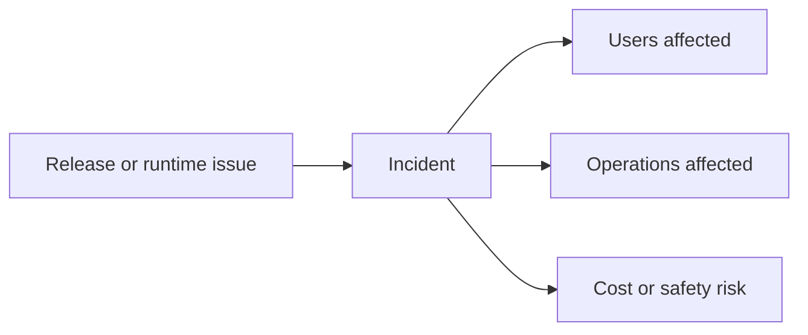
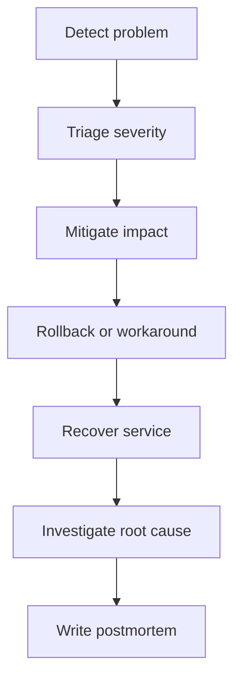
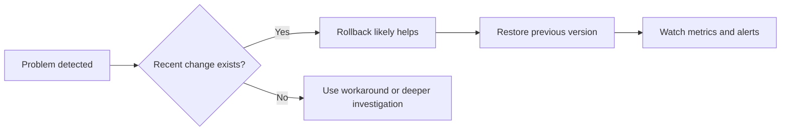
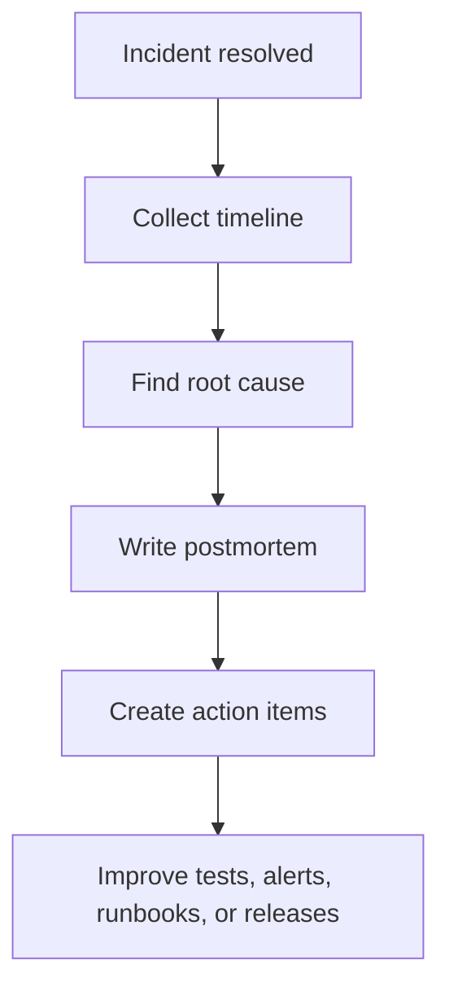

# Rollbacks and Incident Response

<div class="topic-page" markdown="1">

<section class="topic-hero">
  <span class="topic-hero__eyebrow">Stage 13 - Production Deployment</span>
  <p class="topic-hero__lead">Rollbacks and incident response are the safety systems you use when a production AI agent goes wrong. A rollback helps you return to a safer previous version. Incident response helps you detect the problem, reduce user impact, investigate the cause, and recover the service.</p>
  <div class="topic-hero__facts">
    <span>Detection</span>
    <span>Mitigation</span>
    <span>Rollback</span>
    <span>Recovery</span>
    <span>Postmortem</span>
  </div>
</section>

## Goal

Understand rollbacks and incident response for AI agent systems in a simple, beginner-friendly way.

After this lesson, you should be able to explain:

- what a rollback is,
- what an incident is,
- how teams respond when an AI agent fails in production,
- when to rollback prompts, code, models, or tools,
- how monitoring and alerts support incident response,
- why post-incident learning matters.

## Quick Summary

Use this table first.

| Part | Simple Meaning | Why It Matters |
| --- | --- | --- |
| incident | real production problem | users are affected or risk is rising |
| detection | noticing the problem | starts response quickly |
| mitigation | reduce immediate damage | protects users and systems |
| rollback | return to safer version | fast recovery path |
| recovery | restore normal service | finish incident response |
| postmortem | learn after the incident | prevents repeat failures |

Beginner rule:

```text
Do not wait to fully understand the problem
before reducing the damage.
```

## Before You Start

Start with one simple idea:

```text
In production, failure is not surprising.
The important question is how quickly and safely you respond.
```

Example:

```text
A new prompt release makes the agent send wrong summaries.

Good response:
  detect quickly
  stop the bad behavior
  rollback
  investigate later in more detail
```

### Key Words In Plain English

| Word | Simple Meaning | Beginner Example |
| --- | --- | --- |
| Incident | important live-system problem | users get wrong answers |
| Mitigation | immediate damage reduction | disable risky tool |
| Rollback | switch back to older working version | restore previous prompt or image |
| Root cause | the real underlying reason | bad prompt change |
| Postmortem | review after incident | what happened and how to prevent it |
| Escalation | involve more people | call on on-call engineer |
| Runbook | written response steps | how to disable tool access |

## Learning Path

This topic is designed in four parts. Read them in order.

<div class="learning-grid learning-grid--path">
  <a class="learning-card" href="#part-1-understand-what-can-go-wrong">
    <strong>Part 1 - Understand What Can Go Wrong</strong>
    <span>Learn common production failures in AI agent systems.</span>
  </a>
  <a class="learning-card" href="#part-2-follow-the-incident-response-flow">
    <strong>Part 2 - Follow The Incident Response Flow</strong>
    <span>See the steps from detection to recovery.</span>
  </a>
  <a class="learning-card" href="#part-3-learn-rollback-options">
    <strong>Part 3 - Learn Rollback Options</strong>
    <span>Understand what can be rolled back and when.</span>
  </a>
  <a class="learning-card" href="#part-4-improve-after-the-incident">
    <strong>Part 4 - Improve After The Incident</strong>
    <span>Use postmortems, runbooks, and safer release habits.</span>
  </a>
</div>

## Part 1: Understand What Can Go Wrong

AI agent systems can fail in several ways.

Simple definition:

```text
An incident is a production problem
that harms users, business operations, cost, safety, or reliability.
```

### The Big Picture



**How to read this diagram:** an incident is not only a code crash. It can also be bad answers, risky actions, high costs, or a stuck workflow.

### Common AI Agent Incident Types

| Incident Type | Example |
| --- | --- |
| bad answer quality | summaries become misleading |
| tool failure | search tool times out for most requests |
| prompt regression | agent starts using wrong format |
| cost spike | token usage doubles after release |
| latency spike | responses become too slow |
| unsafe behavior | agent attempts risky action |
| queue backlog | jobs stop finishing on time |

### Why AI Incidents Need Fast Response

| Problem | Why It Is Dangerous |
| --- | --- |
| wrong answers at scale | many users get bad results quickly |
| broken tools | workflows fail repeatedly |
| cost anomaly | spend can grow very fast |
| safety issue | may create real-world damage |

## Part 2: Follow The Incident Response Flow

Incident response is easier to learn as a simple sequence.

### Incident Response Diagram



### Response Flow Table

| Step | What Happens | Why It Matters |
| --- | --- | --- |
| 1 | detect the issue | starts response quickly |
| 2 | assess severity | decide how serious it is |
| 3 | mitigate damage | protect users first |
| 4 | rollback or workaround | restore safer behavior |
| 5 | recover service | return to stable operation |
| 6 | investigate cause | learn why it happened |
| 7 | document and improve | reduce repeat incidents |

### Example Incident

Problem:

```text
After a new release, the agent starts returning incomplete support reports.
```

Possible response:

1. Alert fires for answer quality regression.
2. Team confirms user impact.
3. Disable the new prompt version.
4. Roll back to previous prompt configuration.
5. Monitor whether success rate returns to normal.
6. Investigate what changed.

### Triage Questions

| Question | Why Ask It |
| --- | --- |
| Are users currently affected? | determines urgency |
| Is there safety or legal risk? | may require immediate escalation |
| Did a recent release cause this? | suggests rollback path |
| Can we reduce damage quickly? | helps choose mitigation |

## Part 3: Learn Rollback Options

Rollback does not only mean code rollback.

### Rollback Targets

| What Can Be Rolled Back | Example |
| --- | --- |
| application code | restore previous backend image |
| prompt version | restore earlier system prompt |
| model choice | switch back to previous model |
| tool configuration | disable or restore old tool version |
| feature flag | turn off new behavior |
| workflow config | revert step limits or routing rules |

### Rollback Decision Diagram



### When Rollback Is A Good Choice

| Situation | Why Rollback Helps |
| --- | --- |
| recent release caused failure | returns known-good state |
| prompt change harmed quality | fast way to recover output behavior |
| model change increased cost or latency | restore previous balance |
| new tool integration broke flows | disable risky integration |

### When Rollback May Not Be Enough

| Situation | Better Action |
| --- | --- |
| provider-wide outage | use fallback model or degrade service |
| backlog from traffic spike | scale workers or rate limit |
| bad external data source | disable source or validate input |

### Beginner Rule For Rollback

```text
If a recent change caused a major problem
and an older version was stable,
rollback is often the fastest safe action.
```

## Part 4: Improve After The Incident

Recovery is not the end. Learning matters too.

### Post-Incident Improvement Diagram



### Good Postmortem Questions

| Question | Why It Matters |
| --- | --- |
| What happened? | creates shared understanding |
| When did it start? | clarifies timeline |
| How was it detected? | improves monitoring |
| What reduced the damage? | keeps good response patterns |
| What should change next? | creates prevention steps |

### Useful Prevention Actions

| Prevention Action | Example |
| --- | --- |
| stronger release checks | add prompt regression test |
| better alerting | detect quality drops earlier |
| feature flags | disable risky features faster |
| clearer runbooks | document rollback steps |
| safer defaults | stricter step or budget limits |

### Beginner Incident Toolkit

Start with these:

| Tool or Practice | Why It Helps |
| --- | --- |
| monitoring dashboards | detect problems early |
| alerts | notify humans quickly |
| versioned releases | make rollback possible |
| runbooks | reduce confusion during incidents |
| postmortems | improve future response |

### Common Beginner Mistakes

| Mistake | Better Approach |
| --- | --- |
| trying to debug too long before mitigating | reduce damage first |
| no versioned prompt or config history | keep rollback targets clear |
| no rollback plan | define one before release |
| no incident notes | capture timeline during response |
| blaming people instead of systems | improve process and tooling |

## Summary

Use this table to remember the main ideas.

| Main Idea | Short Meaning |
| --- | --- |
| incidents are normal in production | prepare instead of assuming perfection |
| detect and mitigate first | protect users quickly |
| rollback is a key recovery tool | return to safer known-good state |
| AI incidents include quality, cost, and safety issues | not only crashes |
| postmortems improve the system | learning prevents repeats |

## Practice

1. Explain the difference between mitigation and rollback.
2. Name four things that may be rolled back in an AI agent system.
3. Explain why alerts matter during an incident.
4. Explain why postmortems are useful.

## Mini Project

Design an incident response plan for an AI support assistant.

Include:

- one alert that detects a serious issue,
- one mitigation action,
- one rollback option,
- one dashboard to inspect,
- three postmortem questions.

Then answer:

1. What should happen first after detection?
2. When should a rollback be chosen?
3. What should be improved after the incident?

## Exit Criteria

You are ready to move on when you can:

- explain what an incident is in an AI agent system,
- describe a simple response flow from detection to recovery,
- name common rollback targets,
- explain the value of postmortems and runbooks.

## Resources

- [Google SRE Book - Managing Incidents](https://sre.google/sre-book/managing-incidents/)
- [Google SRE Book - Postmortem Culture](https://sre.google/sre-book/postmortem-culture/)
- [PagerDuty - Incident Response Guide](https://www.pagerduty.com/resources/learn/incident-response/)
- [LaunchDarkly - Feature Flags](https://launchdarkly.com/docs/home/flags)

</div>
